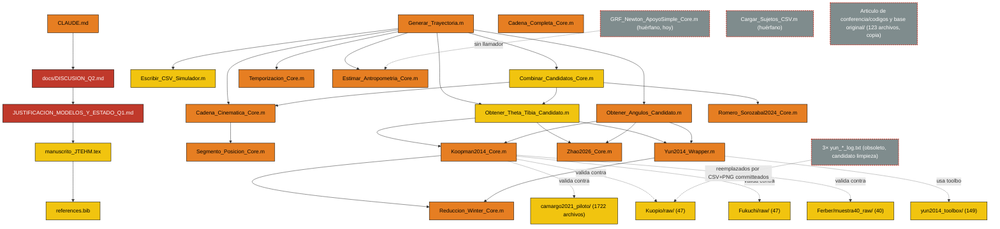

# REVISIÓN — articuloq2 (Simulador de marcha 3-DOF, artículo Q2) — 2026-08-28

> Para ejecutar lo que decida aquí: editar este archivo, guardarlo, y abrir Claude Code con
> el mensaje: "Lee _REVISION/REVISION.md y ejecuta lo aprobado según su protocolo."

## 1. Estado
Inicio: 23:57:56 (27-ago) · Fin: 02:40:50 (28-ago) · Duración total: 2h 42m 54s
Archivos: 543 (538 individuales + 5 carpetas-dataset agregadas) · Comprobados OK: 530 · Con falla: 0 · No comprobable: 13 (formatos de terceros/agregados por regla de alcance) · Justificados: 415 · Propuestos para borrar: 0 (ver §5) · Dudosos: 8 · Hallazgos críticos (severidad alta): 5

## 2. Mapa del proyecto

Mapa completo (con ~230 vínculos catalogados) en `detalle/02_grafo.md` §6.

## 3. Lo importante — núcleo del proyecto

| # | Archivo | Nivel | Puntaje | Por qué importa | Comprobación |
|---|---|---|---|---|---|
| 1 | `docs/algoritmo/JUSTIFICACION_MODELOS_Y_ESTADO_Q1.md` | CRÍTICO | 70 | Documento técnico único y consolidado del generador | OK |
| 2 | `docs/DISCUSION_Q2.md` | CRÍTICO | 70 | Único documento de interacción/decisión del proyecto | OK |
| 3 | `CLAUDE.md` | ALTO | 50 | Contexto maestro, se lee al iniciar cada sesión | OK |
| 4 | `CODIGOS/GENERADOR/Generar_Trayectoria.m` | ALTO | 45 | Orquestador del generador de trayectorias | OK (0 avisos) |
| 5 | `CODIGOS/GENERADOR/Koopman2014_Core.m` | ALTO | 55 | Candidato ganador confirmado en rodilla/tobillo/tibia (3 fuentes reales) | OK |
| 6 | `CODIGOS/GENERADOR/Zhao2026_Core.m` | ALTO | 45 | Candidato secundario, sin PDF de referencia en `references.bib` del manuscrito | OK |
| 7 | `CODIGOS/GENERADOR/Yun2014_Wrapper.m` | ALTO | 45 | Candidato secundario, envuelve toolbox GPR de terceros | OK |
| 8 | `CODIGOS/GENERADOR/Romero_Sorozabal2024_Core.m` | ALTO | 45 | Candidato de posición 3D directa, con advertencia de signo sin resolver (H2) | OK |
| 9 | `CODIGOS/GENERADOR/Cadena_Cinematica_Core.m` | ALTO | 50 | Encadena segmentos; documentación de regla E2 desactualizada (H6) | OK |
| 10 | `CODIGOS/GENERADOR/Cadena_Completa_Core.m` | ALTO | 45 | Cadena cadera→muslo→rodilla→tibia→tobillo completa | OK |
| 11 | `CODIGOS/GENERADOR/Temporizacion_Core.m` | ALTO | 55 | Motor de temporización compartido por los 3 candidatos | OK |
| 12 | `CODIGOS/GENERADOR/Estimar_Antropometria_Core.m` | ALTO | 50 | 24 llamadores — el nodo más conectado del repo | OK |
| 13 | `CODIGOS/GENERADOR/Reduccion_Winter_Core.m` | ALTO | 40 | Reducción cinemática compartida Koopman/Yun | OK |
| 14 | `CODIGOS/GENERADOR/Obtener_Angulos_Candidato.m` | ALTO | 50 | Punto único de riesgo de desincronización de regla E2 (A3) | OK |
| 15 | `CODIGOS/GENERADOR/Segmento_Posicion_Core.m` | ALTO | 40 | Convierte ángulo+longitud en posición real | OK |
| 16 | `docs/manuscrito/JTEHM_LaTex_Template/manuscrito_JTEHM.tex` | MEDIO | 20 | Manuscrito — 0% de contenido del generador incorporado (H5) | OK, 1 vínculo roto inactivo |
| 17 | `docs/manuscrito/JTEHM_LaTex_Template/references.bib` | MEDIO | 20 | Bibliografía — 10/10 citas resuelven, solo 2/10 con PDF verificable | OK, balance de llaves válido |
| 18-22 | 5 carpetas-dataset públicas (Camargo, Kuopio, Fukuchi, Ferber, toolbox Yun2014) | MEDIO | 40 c/u | Base de validación externa sin circularidad | NO COMPROBABLE por regla de alcance (agregadas) |

Detalle de las 543 filas (una por archivo) en `detalle/07_justificacion.md`.

## 4. Preguntas — responder en la línea R

P1. `CLAUDE.md:108` sigue diciendo JTEHM "vigente", pero `analisis_revistas_Q1_generador.md:53` (27-ago, sin trackear) dice "descartada por completo". ¿Corrijo `CLAUDE.md:108` con la tachadura estándar del documento?
R1:

P2. `plan_ensamble_multimodelo.md` se autodescribe "CERRADA" pero fue pausado el mismo día a favor de "mejor modelo por segmento" (pregunta que el propio proyecto dejó abierta el 24-ago). ¿Sigue abierta, o ya la resolviste en otra sesión no reflejada en los documentos?
R2:

P3. `docs/DISCUSION_Q2.md` §6 (registro obligatorio de decisiones) no tiene filas desde el 23-ago. ¿Se completa con las sesiones 24/25/27-ago?
R3:

P4. `Combinar_Candidatos_Core.m` promedia el eje X de Romero-Sorozábal sin resolver la advertencia de signo que el propio módulo declara (H2). ¿Se invalida `candidato='Combinado'` hasta verificar, o ya se verificó en otro lado?
R4:

P5. ¿Se borran los 3 logs `yun_*.txt` (ver §6)? El propio equipo ya lo pidió por escrito en `REPORTE_NOCHE.md`, pero son de menos de 7 días — el loop no los propone automáticamente por regla dura.
R5:

P6. Los 123 archivos duplicados de `Articulo de conferencia/codigos y base original/` están en uso activo dentro de ese proyecto separado (confirmado, A2). ¿Se documenta como duplicación aceptada, o se investiga apuntar a la raíz en vez de mantener copia?
R6:

P7. `manuscrito_JTEHM.tex:197-200` caracteriza a Marinelli2015 como "simplified sagittal-plane", pero otra fuente sugiere 6-DOF/3D (H9, sin PDF propio para confirmar). ¿Se consigue el PDF antes de fijar la frase, o se reformula con más cautela mientras tanto?
R7:

P8. `GRF_Newton_ApoyoSimple_Core.m`/`MasaSegmentaria_DeLeva1996_Core.m` (nuevos) no tienen `Test_*.m` ni `GUIA_INTERPRETACION.md`, rompiendo la convención propia del proyecto. ¿Se agregan antes de seguir construyendo encima, o es trabajo en curso que se completa después?
R8:

P9. `mejor_modelo_rodilla.md`, `CIERRE_TOBILLO.md`, `CIERRE_INCLINACION_TIBIAL.md` y `JUSTIFICACION_MODELOS_Y_ESTADO_Q1.md` tienen contenido solapado (H7). ¿Se consolidan en un solo documento vigente?
R9:

P10. `docs/ESTADO_Y_RUMBO.md` sigue con banner "no usar para planificar" desde el 19-ago, sin reemplazo del mismo alcance. ¿Se rehace, o se acepta que `CLAUDE.md`+`JUSTIFICACION_MODELOS_Y_ESTADO_Q1.md` cubren ese rol ahora?
R10:

## 5. Borrar — recomendado

Ninguno cumple los 6 criterios simultáneos esta noche (huérfano/duplicado/obsoleto + importancia baja/nula + confianza alta + grado de entrada cero + no es entrada/raíz + **no modificado en los últimos 7 días**). Los candidatos más fuertes (3 logs `yun_*.txt`, ya pedidos de borrar por el propio equipo) son de ayer/hoy y quedan en §6 por la regla dura de antigüedad. Los 123 archivos con hash duplicado en `Articulo de conferencia/` quedan excluidos aunque sean antiguos, porque A2 confirmó que esa carpeta los usa activamente dentro de su propio proyecto (script `Fig5_Datos_Fuerza.m` y similares) — borrarlos rompería ese proyecto separado.

## 6. Dudosos — decide tú

| # | Archivo | Nivel | Duda | Qué falta saber | Detalle | DECISIÓN |
|---|---|---|---|---|---|---|
| 1 | `CODIGOS/GENERADOR/TOBILLO/yun_run_log.txt` | NULO | Log de depuración, el propio equipo pidió borrarlo (`REPORTE_NOCHE.md:53`) | Nada — evidencia ya completa, solo espera fuera de la ventana de 7 días | `detalle/06_datos.md` | ? |
| 2 | `CODIGOS/GENERADOR/INCLINACION_TIBIAL/yun_grupo_log.txt` | NULO | Mismo caso que #1 | Nada | `detalle/06_datos.md` | ? |
| 3 | `CODIGOS/GENERADOR/INCLINACION_TIBIAL/yun_individual_log.txt` | NULO | Mismo caso que #1 | Nada | `detalle/06_datos.md` | ? |
| 4 | `CODIGOS/GENERADOR/GRF_Newton_ApoyoSimple_Core.m` | NULO | Huérfano de hoy, sin llamador ni mención documental | Si es trabajo en curso o se abandonó | `detalle/02_grafo.md` §3, `detalle/03_codigo.md` | ? |
| 5 | `CODIGOS/MULTISUJETO/Cargar_Sujetos_CSV.m` | NULO | Huérfano, pero documentado como infraestructura pendiente intencional | Si sigue vigente el plan de usarlo | `detalle/02_grafo.md` §3 | ? |
| 6 | `docs/literatura/pdfs/chile_extract/*.csv` (2 archivos) | BAJO | Copia byte-idéntica de contenido dentro de `22151474.zip` | Si conviene quedarse solo con el `.zip` | `detalle/06_datos.md` | ? |
| 7 | `Articulo de conferencia/codigos y base original/` (123 archivos) | — (excluido de puntaje por ser de otro proyecto) | Duplicación completa de `CODIGOS/PERSONA SANA/REFERENCIAS/SIMULADOR`, en uso activo dentro de su propio proyecto | Si se puede compartir en vez de duplicar sin romper `Articulo de conferencia/` | `detalle/01_inventario.md` §Perfil, `detalle/02_grafo.md` §5(a) | ? |
| 8 | `references.bib` entradas `Clinical_electrocardiography`/`clustering` | — (dentro de archivo de bibliografía, no tocable por regla dura de este loop) | Huérfanas de citación, ya documentadas como resto intencional de plantilla | Confirmar que se dejan así | `detalle/05_fuentes.md` §2 | ? |

## 7. Problemas (top 10: código, datos, comprobaciones falladas)

| # | Severidad | Dónde | Qué pasa | Detalle | ARREGLAR |
|---|---|---|---|---|---|
| 1 | Alta | `Combinar_Candidatos_Core.m:108-124` | Ignora advertencia de signo de X de Romero-Sorozábal, propia del módulo | `detalle/03_codigo.md` (H2) | NO |
| 2 | Alta | `Cadena_Cinematica_Core.m:100-111`, `GUIA_INTERPRETACION.md:121` | Documentan regla E2 anterior al 24-ago, código real ya cambió | `detalle/03_codigo.md` (H6) | NO |
| 3 | Media | `Generar_Trayectoria.m:139,153`, `GRF_Newton_ApoyoSimple_Core.m:125,133` | Modelo del candidato se corre 2× por llamada; caro para Yun (30 archivos I/O) | `detalle/03_codigo.md` (H8) | NO |
| 4 | Media | `Obtener_Angulos_Candidato.m:38-44` | Riesgo de desincronización de regla E2 entre múltiples consumidores | `detalle/03_codigo.md` | NO |
| 5 | Media | `Calcular_Metricas_Curva.m:1`, `Procesar_Multisujeto_Core.m:128` | Función en minúsculas vs. archivo PascalCase — riesgo en Mac/Linux | `detalle/03_codigo.md` (H13) | NO |
| 6 | Media | `Test_Generador_Trayectoria.m:144` | Ruta absoluta `C:\articuloq2\...` hardcodeada, no portable | `detalle/03_codigo.md`, `detalle/02_grafo.md` §4 (H14) | NO |
| 7 | Media | `GRF_Newton_ApoyoSimple_Core.m`, `MasaSegmentaria_DeLeva1996_Core.m` | Archivos nuevos sin `Test_*.m` ni `GUIA_INTERPRETACION.md` — rompe convención propia | `detalle/03_codigo.md` (H16) | NO |
| 8 | Baja | `Test_Calibracion_Offset.m:18` | Ruta de scratchpad de sesión antigua, con nombre de proyecto obsoleto "GAITSIM" | `detalle/03_codigo.md` (H15) | NO |
| 9 | Media | `docs/literatura/pdfs/koomap.pdf` (Koopman) | Símbolo `±` sigue extrayéndose corrupto en tablas vía `pdftotext` | `detalle/05_fuentes.md` §1 | NO |
| 10 | Baja | `manuscrito_JTEHM.tex:397` | `\includegraphics` roto apuntando a figura inexistente, dentro de bloque comentado (inactivo) | `detalle/02_grafo.md` §4 (H17) | NO |

## 8. Redacción y referencias: lo que no cierra (top 10)

| # | Documento | Qué falla | Veredicto | Detalle | ARREGLAR |
|---|---|---|---|---|---|
| 1 | `CLAUDE.md:108` | JTEHM "vigente" contradice `analisis_revistas_Q1_generador.md:53` (27-ago, "descartada") | CONTRADICTORIO | `detalle/04_redaccion.md` (H1) | NO |
| 2 | `plan_ensamble_multimodelo.md` | Se autodescribe "CERRADA" sin banner de la pausa del mismo día | INCOMPLETO | `detalle/04_redaccion.md` (H3) | NO |
| 3 | `docs/DISCUSION_Q2.md` §6 | Registro obligatorio detenido desde el 23-ago, faltan 3 sesiones | INCOMPLETO | `detalle/04_redaccion.md` (H4) | NO |
| 4 | `manuscrito_JTEHM.tex` + borrador | 0% de contenido del generador incorporado pese al pivote del 19-ago | INCOMPLETO | `detalle/04_redaccion.md` (H5) | NO |
| 5 | `mejor_modelo_rodilla.md:41-43` | Describe como pendiente un trabajo (tobillo, tibia) ya cerrado en otros 2 archivos | INCOMPLETO | `detalle/04_redaccion.md` (H7) | NO |
| 6 | `manuscrito_JTEHM.tex:197-200` | Marinelli2015 caracterizado como "simplificado", posible discrepancia sin PDF propio para verificar | NO VERIFICABLE | `detalle/05_fuentes.md` (H9, F11) | NO |
| 7 | `CIERRE_TOBILLO.md`, `CIERRE_INCLINACION_TIBIAL.md` | Numeración de encabezados duplicada/invertida | ESTRUCTURA | `detalle/04_redaccion.md` (H10) | NO |
| 8 | `analisis_escalamiento_Q1_generador_trayectorias.md:546` | Cita "§6" cuando el tablero real está en §9 | INDETERMINADO | `detalle/04_redaccion.md` (H11) | NO |
| 9 | `analisis_escalamiento_Q1_generador_trayectorias.md:138` | Sigue recomendando IEEE TNSRE, ya descartada (mismo patrón que #1) | SALTO LÓGICO | `detalle/04_redaccion.md` (H12) | NO |
| 10 | `docs/ESTADO_Y_RUMBO.md:3` | Banner "no usar para planificar" desde 19-ago, sin documento maestro reemplazante | INCOMPLETO | `detalle/04_redaccion.md` | NO |

## 9. Órdenes libres

(vacío)
