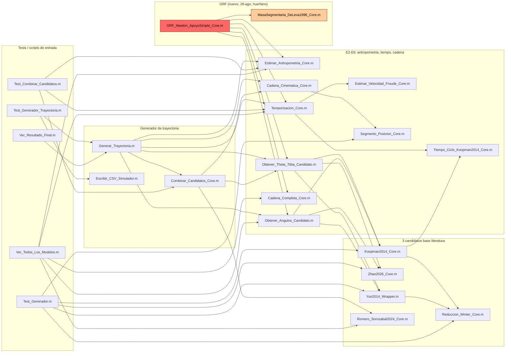
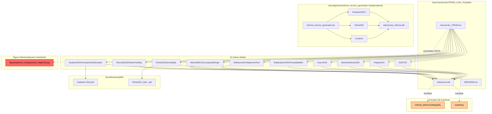
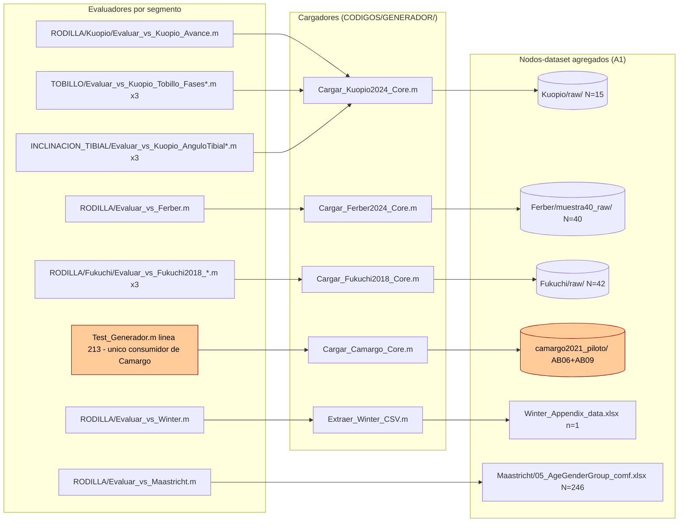

# 02 · Grafo de vínculos — Revisión profunda 2026-08-27/28

> Generado por el subagente A2·GRAFO. Rama `revision/2026-08-27`. Construido sobre `_REVISION/detalle/01_inventario.md` (A1). Método: grep estático de nombres de función/rutas/citas en todo el árbol (excepto `.git/` y `_REVISION/`), sin ejecutar ningún script. Toda afirmación cita `ruta:línea`. Donde no se encontró evidencia, se declara `INDETERMINADO` o "sin evidencia encontrada", nunca se asume.

**Alcance de este grafo.** Catalogar los ~2500+ vínculos potenciales de 538 archivos individuales uno por uno excede lo razonable; en su lugar se mapea con evidencia completa: (1) el grafo de llamadas entre funciones `.m` de `CODIGOS/` (todas las carpetas, ~70 archivos activos), (2) las rutas de datos leídas/escritas por esas funciones, (3) los embebidos de figuras en `.md`/`.tex`, (4) el grafo bibliografía↔manuscrito↔PDF, (5) los enlaces markdown/`\input`/`\include` reales encontrados (son pocos — el proyecto referencia por mención en prosa, no por link markdown, salvo excepciones documentadas), y (6) una muestra dirigida de menciones documentales relevantes para los hallazgos pedidos por el orquestador (a, b, c). Las 5 carpetas-dataset agregadas de A1 se tratan como nodo único cada una, como se pidió.

---

## 1. Tabla de vínculos

### 1.1 Código — grafo de llamadas entre funciones `.m` (CODIGOS/GENERADOR, núcleo del pivote)

| origen | destino | tipo | evidencia | estado |
|---|---|---|---|---|
| `CODIGOS/GENERADOR/Generar_Trayectoria.m` | `Estimar_Antropometria_Core.m` | llamada función | `Generar_Trayectoria.m:93` | RESUELTO |
| `CODIGOS/GENERADOR/Generar_Trayectoria.m` | `Temporizacion_Core.m` | llamada función | `Generar_Trayectoria.m:99` | RESUELTO |
| `CODIGOS/GENERADOR/Generar_Trayectoria.m` | `Combinar_Candidatos_Core.m` | llamada función (solo si candidato='Combinado') | `Generar_Trayectoria.m:120` | RESUELTO |
| `CODIGOS/GENERADOR/Generar_Trayectoria.m` | `Obtener_Theta_Tibia_Candidato.m` | llamada función | `Generar_Trayectoria.m:139` | RESUELTO |
| `CODIGOS/GENERADOR/Generar_Trayectoria.m` | `Obtener_Angulos_Candidato.m` | llamada función | `Generar_Trayectoria.m:153` | RESUELTO |
| `CODIGOS/GENERADOR/Generar_Trayectoria.m` | `Cadena_Cinematica_Core.m` | llamada función (x2) | `Generar_Trayectoria.m:189,223` | RESUELTO |
| `CODIGOS/GENERADOR/Ver_Resultado_Final.m` | `Generar_Trayectoria.m` | llamada función | `Ver_Resultado_Final.m:32` | RESUELTO |
| `CODIGOS/GENERADOR/Test_Generador_Combinado.m` | `Generar_Trayectoria.m` | llamada función (x4) | `Test_Generador_Combinado.m:19,27,54,64` | RESUELTO |
| `CODIGOS/GENERADOR/Test_Generador_Trayectoria.m` | `Generar_Trayectoria.m` | llamada función (x7) | `Test_Generador_Trayectoria.m:86,105,113,134,152,193,197` | RESUELTO |
| `CODIGOS/GENERADOR/Test_Generador_Trayectoria.m` | `Escribir_CSV_Simulador.m` | llamada función | `Test_Generador_Trayectoria.m:114` | RESUELTO |
| `CODIGOS/GENERADOR/Combinar_Candidatos_Core.m` | `Obtener_Theta_Tibia_Candidato.m` | llamada función (x3) | `Combinar_Candidatos_Core.m:80-82` | RESUELTO |
| `CODIGOS/GENERADOR/Combinar_Candidatos_Core.m` | `Cadena_Cinematica_Core.m` | llamada función (x6) | `Combinar_Candidatos_Core.m:101-106` | RESUELTO |
| `CODIGOS/GENERADOR/Combinar_Candidatos_Core.m` | `Romero_Sorozabal2024_Core.m` | llamada función | `Combinar_Candidatos_Core.m:111` | RESUELTO |
| `CODIGOS/GENERADOR/Test_Combinar_Candidatos.m` | `Combinar_Candidatos_Core.m` | llamada función (x2) | `Test_Combinar_Candidatos.m:13,47` | RESUELTO |
| `CODIGOS/GENERADOR/Test_Combinar_Candidatos.m` | `Estimar_Antropometria_Core.m` / `Temporizacion_Core.m` | llamada función | `Test_Combinar_Candidatos.m:10,11` | RESUELTO |
| `CODIGOS/GENERADOR/Obtener_Theta_Tibia_Candidato.m` | `Koopman2014_Core.m` | llamada función | `Obtener_Theta_Tibia_Candidato.m:46` | RESUELTO |
| `CODIGOS/GENERADOR/Obtener_Theta_Tibia_Candidato.m` | `Zhao2026_Core.m` | llamada función | `Obtener_Theta_Tibia_Candidato.m:93` | RESUELTO |
| `CODIGOS/GENERADOR/Obtener_Theta_Tibia_Candidato.m` | `Yun2014_Wrapper.m` | llamada función | `Obtener_Theta_Tibia_Candidato.m:99` | RESUELTO |
| `CODIGOS/GENERADOR/Obtener_Angulos_Candidato.m` | `Koopman2014_Core.m` / `Zhao2026_Core.m` / `Yun2014_Wrapper.m` | llamada función | `Obtener_Angulos_Candidato.m:22,28,33` | RESUELTO |
| `CODIGOS/GENERADOR/Koopman2014_Core.m` | `Tiempo_Ciclo_Koopman2014_Core.m` | llamada función | `Koopman2014_Core.m:82` | RESUELTO |
| `CODIGOS/GENERADOR/Koopman2014_Core.m` | `Reduccion_Winter_Core.m` | llamada función (x3) | `Koopman2014_Core.m:87,104,111` | RESUELTO |
| `CODIGOS/GENERADOR/Yun2014_Wrapper.m` | `Reduccion_Winter_Core.m` | llamada función (x6) | `Yun2014_Wrapper.m:127,132,142,147,154,161` | RESUELTO |
| `CODIGOS/GENERADOR/Temporizacion_Core.m` | `Estimar_Velocidad_Froude_Core.m` | llamada función | `Temporizacion_Core.m:66` | RESUELTO |
| `CODIGOS/GENERADOR/Temporizacion_Core.m` | `Tiempo_Ciclo_Koopman2014_Core.m` | llamada función (x2) | `Temporizacion_Core.m:81,84` | RESUELTO |
| `CODIGOS/GENERADOR/Cadena_Cinematica_Core.m` | `Segmento_Posicion_Core.m` | llamada función | `Cadena_Cinematica_Core.m:147` | RESUELTO |
| `CODIGOS/GENERADOR/GRF_Newton_ApoyoSimple_Core.m` | `Estimar_Antropometria_Core.m` / `Temporizacion_Core.m` / `Obtener_Theta_Tibia_Candidato.m` / `Obtener_Angulos_Candidato.m` / `Cadena_Completa_Core.m` / `MasaSegmentaria_DeLeva1996_Core.m` | llamada función | `GRF_Newton_ApoyoSimple_Core.m:119,124,125,133,144,120` | RESUELTO |
| `CODIGOS/GENERADOR/Ver_Todos_Los_Modelos.m` | `Estimar_Antropometria_Core.m` / `Temporizacion_Core.m` / `Obtener_Angulos_Candidato.m` / `Cadena_Completa_Core.m` / `Romero_Sorozabal2024_Core.m` | llamada función | `Ver_Todos_Los_Modelos.m:14,15,25,26,41` | RESUELTO |
| `CODIGOS/GENERADOR/Test_Generador.m` | `Zhao2026_Core.m` (x3) / `Reduccion_Winter_Core.m` (x5) / `Yun2014_Wrapper.m` / `Koopman2014_Core.m` (x4) / `Segmento_Posicion_Core.m` (x5) / `Cargar_Camargo_Core.m` | llamada función | `Test_Generador.m:52,78,106,122,136,150,164,185,213,241,293,294,333,347,356,368,380,398` | RESUELTO |
| `CODIGOS/GENERADOR/Test_RomeroSorozabal.m` | `Romero_Sorozabal2024_Core.m` (x2) / `Koopman2014_Core.m` | llamada función | `Test_RomeroSorozabal.m:15,73,83,112,161` | RESUELTO |
| `CODIGOS/GENERADOR/RODILLA/Evaluar_Mejor_Modelo_Rodilla.m` | `Estimar_Antropometria_Core.m` / `Temporizacion_Core.m` / `Koopman2014_Core.m` / `Zhao2026_Core.m` / `Yun2014_Wrapper.m` / `Romero_Sorozabal2024_Core.m` / `Cadena_Cinematica_Core.m` (x3) | llamada función | `Evaluar_Mejor_Modelo_Rodilla.m:32,33,47,60,64,69,89-91` | RESUELTO |
| `CODIGOS/GENERADOR/RODILLA/Evaluar_vs_Ferber.m` | `Cargar_Ferber2024_Core.m` / `Estimar_Antropometria_Core.m` / `Temporizacion_Core.m` / `Koopman2014_Core.m` | llamada función | `Evaluar_vs_Ferber.m:51,73,77,78,79` | RESUELTO |
| `CODIGOS/GENERADOR/RODILLA/DIAG_ferber_lados.m` | `Cargar_Ferber2024_Core.m` / `Estimar_Antropometria_Core.m` (x2) / `Temporizacion_Core.m` / `Koopman2014_Core.m` / `Zhao2026_Core.m` (x2) / `Yun2014_Wrapper.m` | llamada función | `DIAG_ferber_lados.m:20,25,31,44,45,47,50,51,52` | RESUELTO |
| `CODIGOS/GENERADOR/RODILLA/Evaluar_vs_Winter.m` | `Extraer_Winter_CSV.m` (dato, no función — lee su CSV de salida) / `Estimar_Antropometria_Core.m` / `Temporizacion_Core.m` / `Koopman2014_Core.m` / `Zhao2026_Core.m` / `Yun2014_Wrapper.m` / `Romero_Sorozabal2024_Core.m` | llamada función + dato | `Evaluar_vs_Winter.m:29,30,33,39,50,53,57` | RESUELTO |
| `CODIGOS/GENERADOR/RODILLA/Extraer_Winter_CSV.m` | `RODILLA/Winter_Cadera_Rodilla_Tobillo.csv` (escribe) | escritura CSV | `Extraer_Winter_CSV.m:45` | RESUELTO |
| `CODIGOS/GENERADOR/RODILLA/Evaluar_vs_Winter.m` | `RODILLA/Winter_Cadera_Rodilla_Tobillo.csv` (lee) | lectura CSV | `Evaluar_vs_Winter.m:33` | RESUELTO |
| `CODIGOS/GENERADOR/RODILLA/Evaluar_vs_Maastricht.m` | `Estimar_Antropometria_Core.m` / `Temporizacion_Core.m` / `Koopman2014_Core.m` / `Zhao2026_Core.m` / `Yun2014_Wrapper.m` | llamada función | `Evaluar_vs_Maastricht.m:37,38,50,53,64` | RESUELTO |
| `CODIGOS/GENERADOR/RODILLA/Kuopio/Evaluar_vs_Kuopio_Avance.m` | `Cargar_Kuopio2024_Core.m` / `Estimar_Antropometria_Core.m` / `Koopman2014_Core.m` | llamada función | `Evaluar_vs_Kuopio_Avance.m:79,96,98,100` | RESUELTO |
| `CODIGOS/GENERADOR/TOBILLO/*` (3 archivos: `Fases.m`, `_Zhao.m`, `_Yun.m`) | `Cargar_Kuopio2024_Core.m` / `Estimar_Antropometria_Core.m` / `Temporizacion_Core.m` / `Obtener_Angulos_Candidato.m` / `Cadena_Completa_Core.m` | llamada función | `Evaluar_vs_Kuopio_Tobillo_Fases.m:89,106,110-112,162`; `_Zhao.m:92,109,113-115,165`; `_Yun.m:107,124,128-130,181` | RESUELTO |
| `CODIGOS/GENERADOR/INCLINACION_TIBIAL/*` (3 archivos) | `Cargar_Kuopio2024_Core.m` / `Estimar_Antropometria_Core.m` / `Koopman2014_Core.m` o `Zhao2026_Core.m` o `Yun2014_Wrapper.m` | llamada función | `Evaluar_vs_Kuopio_AnguloTibial.m:59,72,76,77`; `_Zhao.m:47,60,64,65`; `_Yun.m:55,68,72,74` | RESUELTO |
| `CODIGOS/GENERADOR/TOBILLO/DIAG_ladotrick_Tobillo.m` | `Cargar_Kuopio2024_Core.m` / `Estimar_Antropometria_Core.m` / `Temporizacion_Core.m` / `Zhao2026_Core.m` (x2) / `Yun2014_Wrapper.m` / `Cadena_Completa_Core.m` | llamada función | `DIAG_ladotrick_Tobillo.m:26,44,48,49,58,59,65,114` | RESUELTO |
| `CODIGOS/GENERADOR/INCLINACION_TIBIAL/DIAG_ladotrick_AnguloTibial.m` | `Cargar_Kuopio2024_Core.m` / `Estimar_Antropometria_Core.m` / `Zhao2026_Core.m` (x2) / `Yun2014_Wrapper.m` | llamada función | `DIAG_ladotrick_AnguloTibial.m:21,34,38,40,41,47` | RESUELTO |
| `CODIGOS/GENERADOR/RODILLA/Fukuchi/Evaluar_vs_Fukuchi2018_*.m` (3 archivos) | `Cargar_Fukuchi2018_Core.m` / `Estimar_Antropometria_Core.m` / `Temporizacion_Core.m` / `Koopman2014_Core.m` / `Zhao2026_Core.m` / `Yun2014_Wrapper.m` | llamada función | `Evaluar_vs_Fukuchi2018_Angulos.m:76,82,86,94,95,105`; `Evaluar_Individual_Fukuchi2018_Angulos.m:54,60,63,69,70,79`; `Evaluar_vs_Fukuchi2018_KoopmanZhao.m:43,49,52,58,59` | RESUELTO |
| `CODIGOS/GENERADOR/Comparar_Caminos_vs_ControlLuis.m` | `Estimar_Antropometria_Core.m` / `Temporizacion_Core.m` / `Koopman2014_Core.m` | llamada función | `Comparar_Caminos_vs_ControlLuis.m:42,43,44` | RESUELTO |
| `CODIGOS/GENERADOR/Comparar_Caminos_vs_ControlLuis.m` | `REFERENCIAS/Control_apoyo_Luis_V4.csv` + `Control_balanceo_Luis_V4.csv` | lectura CSV real | `Comparar_Caminos_vs_ControlLuis.m:19,20` | RESUELTO |
| `CODIGOS/GENERADOR/RODILLA/Evaluar_Mejor_Modelo_Rodilla.m` | `REFERENCIAS/Control_apoyo_Luis_V4.csv` + `Control_balanceo_Luis_V4.csv` | lectura CSV real | `Evaluar_Mejor_Modelo_Rodilla.m:38,39` | RESUELTO |
| `CODIGOS/GENERADOR/Test_Generador_Trayectoria.m` | `C:\articuloq2\REFERENCIAS\Control_apoyo_Luis_V4.csv` | lectura CSV real (ruta absoluta hardcodeada) | `Test_Generador_Trayectoria.m:144` | RESUELTO (pero ruta absoluta no portable — ver §4 hallazgo) |
| `CODIGOS/GENERADOR/Cargar_Camargo_Core.m` | `docs/literatura/pdfs/camargo2021_piloto/` (AB06/AB09) | lectura dataset agregado | `Cargar_Camargo_Core.m:1-23,174` (carga marcadores/IK OpenSim del sujeto pedido) | RESUELTO |
| `CODIGOS/GENERADOR/Test_Generador.m` | `Cargar_Camargo_Core.m` | llamada función | `Test_Generador.m:213` | RESUELTO |
| `CODIGOS/GENERADOR/Segmento_Posicion_Core.m` (comentario) | `Cargar_Camargo_Core.m` | mención documental (no llamada real) | `Segmento_Posicion_Core.m:55-56` | RESUELTO (documental) |
| `CODIGOS/GENERADOR/RODILLA/Kuopio/Cargar_Kuopio2024_Core.m` | `RODILLA/Kuopio/raw/subjects_meta.csv` + `raw/*.csv` (trials) | lectura dataset agregado | `Cargar_Kuopio2024_Core.m:65,88` | RESUELTO |
| `CODIGOS/GENERADOR/RODILLA/Ferber/Cargar_Ferber2024_Core.m` | `RODILLA/Ferber/muestra40_raw/*.json` | lectura dataset agregado | `Cargar_Ferber2024_Core.m:74` (jsondecode) | RESUELTO |
| `CODIGOS/GENERADOR/RODILLA/DIAG_ferber_lados.m` + `Evaluar_vs_Ferber.m` | `RODILLA/Ferber/muestra_40.csv` | lectura CSV | `DIAG_ferber_lados.m:20`; `Evaluar_vs_Ferber.m:51` | RESUELTO |
| `RODILLA/Ferber/muestra_40.csv` | (productor) | — | sin evidencia de script en `CODIGOS/` que lo genere hoy | INDETERMINADO (ver §4) |
| `CODIGOS/GENERADOR/RODILLA/Fukuchi/Cargar_Fukuchi2018_Core.m` | `RODILLA/Fukuchi/raw/WBDSinfo.xlsx` + `raw/WBDSascii/*` | lectura dataset agregado | `Cargar_Fukuchi2018_Core.m:76` | RESUELTO |
| `CODIGOS/GENERADOR/RODILLA/Extraer_Winter_CSV.m` | `RODILLA/Winter_Appendix_data.xlsx` | lectura xlsx | `Extraer_Winter_CSV.m:23` | RESUELTO |
| `CODIGOS/GENERADOR/RODILLA/Evaluar_vs_Maastricht.m` | `RODILLA/Maastricht/05_AgeGenderGroup_comf.xlsx` | lectura xlsx | `Evaluar_vs_Maastricht.m:41` | RESUELTO |
| `CODIGOS/GENERADOR/RODILLA/Ferber/gait_kinematics.m` / `gait_steps.m` / `pca_td.m` / `pca_to.m` | (toolbox de terceros, Running Injury Clinic) | — | no participan del grafo propio del proyecto (código de terceros embebido, `LICENSE_RunningInjuryClinic.txt`) | INDETERMINADO (fuera de alcance, código de terceros) |

### 1.2 Código — resto de `CODIGOS/` (CALIBRACION, ESTADISTICA, MULTISUJETO, POTENCIA_EQUIVALENCIA, INCERTIDUMBRE, VALIDACIONES, GENERAR CURVS DE REFERENCIA)

| origen | destino | tipo | evidencia | estado |
|---|---|---|---|---|
| `CODIGOS/CALIBRACION/Test_Calibracion_Offset.m` | `Calibracion_Offset_Core.m` | llamada función | `Test_Calibracion_Offset.m:89` | RESUELTO |
| `CODIGOS/CALIBRACION/Calibracion_Offset_Vertical.m` | `Calibracion_Offset_Core.m` | llamada función | `Calibracion_Offset_Vertical.m:43` | RESUELTO |
| `CODIGOS/CALIBRACION/Calibracion_Offset_Vertical.m` | carpeta de datos `Offset_<mm>_<n>.txt` (interactiva, `uigetdir`) | lectura interactiva, sin ruta fija | `Calibracion_Offset_Vertical.m:17-19` (formato esperado documentado) | RESUELTO (mecanismo interactivo, no ruta literal) |
| `CODIGOS/CALIBRACION/GUIA_INTERPRETACION.md` | `CODIGOS/CALIBRACION/EJEMPLO_PRUEBA_NO_ES_DATO_REAL/` | mención documental (advierte que el resultado no es real) | `GUIA_INTERPRETACION.md:17,109` | RESUELTO (documental) |
| `CODIGOS/ESTADISTICA/Test_SPM1D_BlandAltman.m` | `SPM1D_Core.m` (x3) / `BlandAltman_Core.m` (x3) / `Extraer_Features0D.m` | llamada función | `Test_SPM1D_BlandAltman.m:32,48,73,94,107,123,135` | RESUELTO |
| `CODIGOS/ESTADISTICA/Aplicar_SPM_BlandAltman_CurvasExistentes.m` | `SPM1D_Core.m` (x3) | llamada función | `Aplicar_SPM_BlandAltman_CurvasExistentes.m:102,107,166` | RESUELTO |
| `CODIGOS/ESTADISTICA/Aplicar_SPM_BlandAltman_CurvasExistentes.m` | `BlandAltman_Core.m` | — | **sin evidencia de llamada** (documentado como no ejecutable hoy, ver §4) | ROTO/NO-EJECUTADO (esperado, documentado) |
| `CODIGOS/ESTADISTICA/Aplicar_SPM_BlandAltman_CurvasExistentes.m` | `REFERENCIAS/BaseDatos_Plataforma_Apoyo.mat` / `_Balanceo.mat` / `BaseDatos_FuerzaVertical.mat` | lectura interactiva (`uigetfile`) | `Aplicar_SPM_BlandAltman_CurvasExistentes.m:56,60,116` | RESUELTO |
| `CODIGOS/VALIDACIONES/Validacion_Plataforma.m` | `REFERENCIAS/BaseDatos_Plataforma_Apoyo.mat` / `_Balanceo.mat` | lectura interactiva (`uigetfile`) | `Validacion_Plataforma.m:23,26` | RESUELTO |
| `CODIGOS/GENERAR CURVS DE REFERENCIA/Angulo_Control_Plataforma.m` | `REFERENCIAS/BaseDatos_Plataforma_Apoyo.mat` / `_Balanceo.mat` | escritura | `Angulo_Control_Plataforma.m:251,255` | RESUELTO |
| `CODIGOS/GENERAR CURVS DE REFERENCIA/Base_Datos_GRF.m` | `REFERENCIAS/BaseDatos_FuerzaVertical.mat` | escritura | `Base_Datos_GRF.m:329,337` | RESUELTO |
| `CODIGOS/VALIDACIONES/Validacion_Plataforma.m` / `Validacion_Fuerza.m` | funciones locales `calcular_estadistica`/`calcular_icc31` (embebidas, NO llaman a `Calcular_Metricas_Curva.m`) | función local, sin vínculo externo | `Validacion_Plataforma.m:420,484`; `Validacion_Fuerza.m:619,683` | RESUELTO (confirma independencia documentada en `CLAUDE.md`) |
| `CODIGOS/MULTISUJETO/Procesar_Multisujeto_Core.m` | `Extraer_Features0D.m` / `calcular_metricas_curva` (`Calcular_Metricas_Curva.m`) / `SPM1D_Core.m` (x2) | llamada función | `Procesar_Multisujeto_Core.m:120,128,146,173` | RESUELTO |
| `CODIGOS/MULTISUJETO/Test_Procesar_Multisujeto.m` | `Procesar_Multisujeto_Core.m` (x2) | llamada función, con datos sintéticos inline | `Test_Procesar_Multisujeto.m:55,130` | RESUELTO |
| `CODIGOS/MULTISUJETO/Test_Procesar_Multisujeto.m` | `Cargar_Sujetos_CSV.m` | — | **sin evidencia de llamada** | ROTO (huérfano funcional, ver §3/§4) |
| `CODIGOS/POTENCIA_EQUIVALENCIA/Test_PotenciaApriori_TOST.m` | `PotenciaApriori_Core.m` / `TOST_Core.m` (x4) | llamada función | `Test_PotenciaApriori_TOST.m:43,93,106,118,131` | RESUELTO |
| `CODIGOS/POTENCIA_EQUIVALENCIA/PotenciaApriori_Core.m` | `SPM1D_Core.m` | llamada función | `PotenciaApriori_Core.m:157` | RESUELTO |
| `CODIGOS/INCERTIDUMBRE/Test_PresupuestoIncertidumbre.m` | `PresupuestoIncertidumbre_Core.m` (x6) | llamada función | `Test_PresupuestoIncertidumbre.m:33,52,65,86,100,124` | RESUELTO |

### 1.3 Figuras embebidas (`.md`/`.tex` → `.png`)

Búsqueda exhaustiva de `` y `\includegraphics{...}` en todo el repo (excluido `_REVISION/`). Total: 23 embebidos markdown + 1 `\includegraphics` (comentado) + 5 `\includegraphics` en `JERM Demo.tex` (plantilla oficial IEEE sin tocar).

| origen | destino | evidencia | estado |
|---|---|---|---|
| `docs/algoritmo/JUSTIFICACION_MODELOS_Y_ESTADO_Q1.md` | `CODIGOS/GENERADOR/RODILLA/Evaluar_Mejor_Modelo_Rodilla_figura.png` (x2) | `JUSTIFICACION_MODELOS_Y_ESTADO_Q1.md:61,152` | RESUELTO (archivo existe, fila 310 de `01_inventario.md`) |
| `docs/algoritmo/JUSTIFICACION_MODELOS_Y_ESTADO_Q1.md` | `CODIGOS/GENERADOR/RODILLA/Evaluar_vs_Ferber_figura.png` | `:154` | RESUELTO (fila 312) |
| `docs/algoritmo/JUSTIFICACION_MODELOS_Y_ESTADO_Q1.md` | `pipeline_koopman_kuopio/figuras/06_...png`, `07_...png`, `08_...png`, `09_...png`, `10_...png`, `11_...png` | `:156,158,172,174,189,191` | RESUELTO (filas 425-430) |
| `docs/algoritmo/JUSTIFICACION_MODELOS_Y_ESTADO_Q1.md` | `CODIGOS/GENERADOR/TOBILLO/Evaluar_vs_Kuopio_Tobillo_Fases_Zhao_figura.png` / `_Yun_figura.png` | `:176,178` | RESUELTO (filas 380,377) |
| `docs/algoritmo/JUSTIFICACION_MODELOS_Y_ESTADO_Q1.md` | `CODIGOS/GENERADOR/INCLINACION_TIBIAL/Evaluar_vs_Kuopio_AnguloTibial_Zhao_figura.png` / `_Yun_figura.png` | `:193,195` | RESUELTO (filas 295,292) |
| `docs/algoritmo/JUSTIFICACION_MODELOS_Y_ESTADO_Q1.md` | `CODIGOS/GENERADOR/RODILLA/Fukuchi/Evaluar_vs_Fukuchi2018_KoopmanZhao_figura.png` | `:293` | RESUELTO (fila 335, sin trackear pero presente en disco) |
| `docs/algoritmo/pipeline_koopman_kuopio/PIPELINE_KOOPMAN_KUOPIO.md` | `figuras/01_seleccion_koopman_vs_control_luis.png` ... `figuras/11_...png` (9 embebidos, 01 a 11 salvo el propio 06/07/08/09/10/11 reusados) | `PIPELINE_KOOPMAN_KUOPIO.md:36,40,44,76,80,118,120,131,133,144,146` | RESUELTO (las 11 figuras de `pipeline_koopman_kuopio/figuras/` existen, filas 420-430) |
| `docs/manuscrito/JTEHM_LaTex_Template/manuscrito_JTEHM.tex` | `figuras/spm1d_comparacion3_subjectN.png` | `manuscrito_JTEHM.tex:397` (dentro de bloque `%` comentado, líneas 395-399) | **ROTO** — archivo no existe en ningún lugar del repo (sin coincidencias para `spm1d_comparacion3`); referencia inactiva (comentada), no rompe compilación hoy, pero apunta a un artefacto inexistente si se descomenta |
| `docs/manuscrito/JTEHM_LaTex_Template/JERM Demo.tex` | `myfigure`, `box` (x2), `./figures/beforeAfter.png`, `mshell` | `JERM Demo.tex:446,468,471,562,627` | INDETERMINADO — plantilla oficial IEEE de demostración, sin tocar por el equipo (`docs/manuscrito/JTEHM_LaTex_Template/README_ESTRUCTURA.md` la marca como no editada); esos activos no están en el repo pero son de la plantilla original de IEEE, fuera del contenido propio del proyecto |

### 1.4 Bibliografía — `\cite{}` ↔ `references.bib` ↔ PDFs

**Manuscrito principal** (`docs/manuscrito/JTEHM_LaTex_Template/manuscrito_JTEHM.tex` ↔ `references.bib`):

| clave citada | evidencia de cita | entrada en `references.bib` | PDF correspondiente en `docs/literatura/pdfs/` | estado |
|---|---|---|---|---|
| `Etoundi2022RoboticTestRig` | `manuscrito_JTEHM.tex:194,202` | `references.bib:30` | sin evidencia de PDF propio en el repo (solo la cita) | RESUELTO (cita↔bib); PDF INDETERMINADO |
| `Sudeesh2024CompactGaitSimulator` | `:197,251` | `references.bib:61` | `docs/literatura/pdfs/Sudeesh 2024.pdf` (existe, sin trackear, agregado 27-ago-2026 — ver hallazgo de A1 §41 del inventario: bloqueo 403 aparentemente superado) | RESUELTO (los tres eslabones existen) |
| `Marinelli2015ConceptualDesign` | `:200` | `references.bib:111` | sin evidencia de PDF propio | RESUELTO (cita↔bib); PDF INDETERMINADO |
| `DeRaeve2014AlignmentTool` | `:202` | `references.bib:132` | sin evidencia de PDF propio | RESUELTO (cita↔bib); PDF INDETERMINADO |
| `Piche2022iSenValidity` | `:226,277,511` | `references.bib:235` | `docs/literatura/pdfs/Piche2022_iSen_STT-IWS_validacion_OptiTrack_Measurement198_111442.pdf` | RESUELTO (los tres eslabones existen) |
| `Rattanakoch2023TranstibialIMU` | `:226,282` | `references.bib:172` | sin evidencia de PDF propio | RESUELTO (cita↔bib); PDF INDETERMINADO |
| `KooLi2016` | `:345` | `references.bib:257` | sin PDF (cita metodológica, no de literatura de dominio) | RESUELTO (cita↔bib) |
| `NicholsHolmes2002` | `:350` | `references.bib:272` | sin PDF | RESUELTO (cita↔bib) |
| `Pataky2015` | `:354` | `references.bib:288` | sin PDF | RESUELTO (cita↔bib) |
| `ISO5725` | `:355` | `references.bib:309` (`@misc`) | sin PDF (norma) | RESUELTO (cita↔bib) |
| — | — | `references.bib:326` `Clinical_electrocardiography` | — | **grado de entrada 0** — nunca citada en `manuscrito_JTEHM.tex` ni en `JERM Demo.tex`; único otro match en el repo es texto no relacionado (`README_Ferber2024_original.txt`, coincidencia de palabra, no de clave bib) — entrada huérfana, probable resto de la plantilla `JERM Demo.tex` |
| — | — | `references.bib:333` `clustering` | — | **grado de entrada 0** — mismo caso, huérfana |

**Informe técnico del generador** (`docs/algoritmo/informe_tecnico_generador/informe_tecnico_generador.tex`, sin trackear — nuevo 27-ago-2026): usa su propio `referencias_informe.bib`, **independiente** de `references.bib` del manuscrito JTEHM.

| clave citada | evidencia | entrada en `referencias_informe.bib` | estado |
|---|---|---|---|
| `Koopman2014` | `informe_tecnico_generador.tex:116` | `referencias_informe.bib:1` | RESUELTO |
| `Zhao2026` | `:116` | `referencias_informe.bib:24` | RESUELTO |
| `Yun2014` | `:116` | `referencias_informe.bib:12` | RESUELTO |

Sin `\includegraphics` ni `\input`/`\include` en `informe_tecnico_generador.tex` (grep vacío). Documento autocontenido, sin figuras propias, desconectado del árbol de figuras de `pipeline_koopman_kuopio/`.

### 1.5 Enlaces markdown / `\input`/`\include` reales

Búsqueda exhaustiva de `[texto](ruta)` no-http y `\input{}`/`\include{}`/`\bibliography{}` en todo el repo:

| origen | destino(s) | evidencia | estado |
|---|---|---|---|
| `.claude/skills/matlab/SKILL.md` | 8 archivos en `references/*.md` + 3 en `assets/*.json` (22 enlaces totales, algunos repetidos) | `SKILL.md:38,39,110,128,129,144,155,169,190,191,214,251-262` | RESUELTO — los 11 archivos destino existen (filas 65-76 y 68-75 de `01_inventario.md`) |
| `docs/manuscrito/JTEHM_LaTex_Template/manuscrito_JTEHM.tex` | ningún `\input`/`\include`/`\bibliography` activo (documento monolítico) | grep vacío salvo coincidencias falsas de `include` dentro de `\includegraphics` comentado | INDETERMINADO (el documento no declara `\bibliography{references}` explícitamente en el grep — ver nota §4) |

Ningún otro `.md`/`.tex` del proyecto usa sintaxis de enlace markdown estándar — el resto de la documentación cruza referencias por mención de nombre de archivo en prosa (categoría 1.6), consistente con la convención ya usada en `CLAUDE.md`.

### 1.6 Menciones documentales relevantes (muestra dirigida, no exhaustiva)

| origen | destino mencionado | evidencia | estado |
|---|---|---|---|
| `docs/algoritmo/JUSTIFICACION_MODELOS_Y_ESTADO_Q1.md:313` | `CODIGOS/GENERADOR/TOBILLO/DIAG_ladotrick_Tobillo.m`, `INCLINACION_TIBIAL/DIAG_ladotrick_AnguloTibial.m` | línea 313 | RESUELTO (documenta los 2 scripts nuevos del 27-ago) |
| `CODIGOS/GENERADOR/Segmento_Posicion_Core.m:20,33` | `REFERENCIAS/Control_apoyo_Luis_V4.csv` | comentario | RESUELTO (documental, no I/O real en ese archivo) |
| `CODIGOS/GENERADOR/Cadena_Cinematica_Core.m:32` | `Desplazamientos.m` (línea 12 de ese script) | comentario | RESUELTO (documental — misma convención de normalización, sin llamada real) |
| `CODIGOS/MULTISUJETO/Cargar_Sujetos_CSV.m:7,26,112` | `CODIGOS/VALIDACIONES/Validacion_Plataforma.m` | comentario | RESUELTO (documental — mismo parseo, sin llamada real) |
| `Articulo de conferencia/codigos figura 5/Fig5_Datos_Fuerza.m:4` | `CODIGOS/VALIDACIONES/Validacion_Fuerza.m` | comentario ("COPIA de... con la LOGICA DE...") | RESUELTO (documental, dentro del mismo subproyecto — ver §hallazgo (a) abajo) |
| `Articulo de conferencia/codigos figura 5/Fig5_Datos_Plataforma.m:4` | `CODIGOS/VALIDACIONES/Validacion_Plataforma.m` | comentario | RESUELTO (documental, ídem) |
| `docs/algoritmo/busqueda_modelos_antropometria_rodilla.md:30` | `docs/literatura/pdfs/22151474.zip`, `docs/literatura/pdfs/chile_extract/*.csv` | línea 30 | RESUELTO (documental) — **sin código consumidor**: ningún `.m` lee `chile_extract/` ni `22151474.zip` (ver §4) |
| `_REVISION/detalle/01_inventario.md` | `GRF_Newton_ApoyoSimple_Core.m`, `MasaSegmentaria_DeLeva1996_Core.m` | fila del inventario | RESUELTO — pero **ningún `.md` del propio proyecto** (ni `CLAUDE.md`, ni `DECISIONES.md`, ni `GUIA_INTERPRETACION.md`, ni `PLAN_ZHAO_YUN.md`) menciona estos 2 archivos nuevos del 27/28-ago-2026 — confirmado con grep dirigido, cero coincidencias fuera de `01_inventario.md` | Documentación pendiente de estos 2 archivos (ver §3) |

---

## 2. Grado de entrada/salida por nodo (archivos relevantes de `CODIGOS/`)

Calculado sobre el grafo de llamadas de función de §1.1-1.2 (no incluye menciones documentales de §1.6, que se cuentan aparte donde son relevantes).

| archivo | grado de entrada (llamadas recibidas) | grado de salida (llamadas hechas) |
|---|---|---|
| `CODIGOS/GENERADOR/Estimar_Antropometria_Core.m` | 24 (Generar_Trayectoria, GRF_Newton_ApoyoSimple_Core, Comparar_Caminos_vs_ControlLuis, Test_Combinar_Candidatos, Test_Generador_Trayectoria×3, Test_Generador_Combinado, 3×DIAG/Evaluar_Kuopio_AnguloTibial, Evaluar_Mejor_Modelo_Rodilla, DIAG_ferber_lados×2, Evaluar_vs_Ferber, Evaluar_vs_Maastricht, Evaluar_vs_Winter, Ver_Todos_Los_Modelos, DIAG_ladotrick_Tobillo, 3×Evaluar_vs_Kuopio_Tobillo_Fases, Evaluar_vs_Kuopio_Avance, 3×Evaluar_Fukuchi2018) | 0 |
| `CODIGOS/GENERADOR/Temporizacion_Core.m` | 17 | 2 (Estimar_Velocidad_Froude_Core, Tiempo_Ciclo_Koopman2014_Core) |
| `CODIGOS/GENERADOR/Koopman2014_Core.m` | 15 | 2 (Tiempo_Ciclo_Koopman2014_Core, Reduccion_Winter_Core) |
| `CODIGOS/GENERADOR/Zhao2026_Core.m` | 13 | 0 |
| `CODIGOS/GENERADOR/Yun2014_Wrapper.m` | 12 | 1 (Reduccion_Winter_Core; internamente además cd() al toolbox de terceros `yun2014_toolbox/`, no contado como llamada de función propia) |
| `CODIGOS/GENERADOR/Reduccion_Winter_Core.m` | 14 (3 Koopman + 6 Yun + 5 Test_Generador) | 0 |
| `CODIGOS/GENERADOR/Cadena_Cinematica_Core.m` | 10 | 1 (Segmento_Posicion_Core) |
| `CODIGOS/GENERADOR/Obtener_Theta_Tibia_Candidato.m` | 4 (Generar_Trayectoria, Combinar_Candidatos_Core×3-vía-loop, GRF_Newton_ApoyoSimple_Core) | 3 (Koopman, Zhao, Yun) |
| `CODIGOS/GENERADOR/Obtener_Angulos_Candidato.m` | 6 (Generar_Trayectoria, GRF_Newton_ApoyoSimple_Core, Ver_Todos_Los_Modelos, 3×TOBILLO/Evaluar_vs_Kuopio_Tobillo_Fases) | 3 (Koopman, Zhao, Yun) |
| `CODIGOS/GENERADOR/Generar_Trayectoria.m` | 3 (Ver_Resultado_Final, Test_Generador_Combinado, Test_Generador_Trayectoria) | 6 (Estimar_Antropometria_Core, Temporizacion_Core, Combinar_Candidatos_Core, Obtener_Theta_Tibia_Candidato, Obtener_Angulos_Candidato, Cadena_Cinematica_Core) |
| `CODIGOS/GENERADOR/Escribir_CSV_Simulador.m` | 1 (Test_Generador_Trayectoria) | 0 |
| `CODIGOS/GENERADOR/Combinar_Candidatos_Core.m` | 2 (Generar_Trayectoria, Test_Combinar_Candidatos) | 3 (Obtener_Theta_Tibia_Candidato, Cadena_Cinematica_Core, Romero_Sorozabal2024_Core) |
| `CODIGOS/GENERADOR/Cadena_Completa_Core.m` | 6 (GRF_Newton_ApoyoSimple_Core, Ver_Todos_Los_Modelos, DIAG_ladotrick_Tobillo, 3×TOBILLO/Evaluar_vs_Kuopio_Tobillo_Fases) | 0 |
| `CODIGOS/GENERADOR/Romero_Sorozabal2024_Core.m` | 6 (Combinar_Candidatos_Core, Ver_Todos_Los_Modelos, Test_RomeroSorozabal×2, Evaluar_vs_Winter, Evaluar_Mejor_Modelo_Rodilla) | 0 |
| `CODIGOS/GENERADOR/Segmento_Posicion_Core.m` | 6 (Cadena_Cinematica_Core, Test_Generador.m×5) | 0 |
| `CODIGOS/GENERADOR/Cargar_Camargo_Core.m` | 1 (Test_Generador.m) | 0 (más 1 mención documental desde Segmento_Posicion_Core.m) |
| `CODIGOS/GENERADOR/RODILLA/Kuopio/Cargar_Kuopio2024_Core.m` | 9 (Evaluar_vs_Kuopio_Avance, 3×TOBILLO/Evaluar_vs_Kuopio_Tobillo_Fases, 3×INCLINACION_TIBIAL/Evaluar_vs_Kuopio_AnguloTibial, DIAG_ladotrick_Tobillo, DIAG_ladotrick_AnguloTibial) | 0 (lee dataset agregado `Kuopio/raw/`) |
| `CODIGOS/GENERADOR/RODILLA/Ferber/Cargar_Ferber2024_Core.m` | 2 (DIAG_ferber_lados, Evaluar_vs_Ferber) | 0 (lee dataset agregado `Ferber/muestra40_raw/`) |
| `CODIGOS/GENERADOR/RODILLA/Fukuchi/Cargar_Fukuchi2018_Core.m` | 3 (los 3 `Evaluar_*Fukuchi2018*.m`) | 0 (lee dataset agregado `Fukuchi/raw/`) |
| `CODIGOS/GENERADOR/RODILLA/Extraer_Winter_CSV.m` | 0 | 0 (lee `Winter_Appendix_data.xlsx`, escribe `Winter_Cadera_Rodilla_Tobillo.csv`) |
| `CODIGOS/GENERADOR/RODILLA/Evaluar_vs_Winter.m` | 0 | 5 + lectura de `Winter_Cadera_Rodilla_Tobillo.csv` |
| `CODIGOS/GENERADOR/GRF_Newton_ApoyoSimple_Core.m` | **0** | 6 (Estimar_Antropometria_Core, Temporizacion_Core, Obtener_Theta_Tibia_Candidato, Obtener_Angulos_Candidato, Cadena_Completa_Core, MasaSegmentaria_DeLeva1996_Core) |
| `CODIGOS/GENERADOR/MasaSegmentaria_DeLeva1996_Core.m` | 1 (GRF_Newton_ApoyoSimple_Core) | 0 |
| `CODIGOS/ESTADISTICA/SPM1D_Core.m` | 8 (Test_SPM1D_BlandAltman×3, Aplicar_SPM_BlandAltman_CurvasExistentes×3, Procesar_Multisujeto_Core×2, PotenciaApriori_Core) — 9 en total sumando todos los archivos | vario |
| `CODIGOS/ESTADISTICA/BlandAltman_Core.m` | 3 (solo `Test_SPM1D_BlandAltman.m`) | 0 |
| `CODIGOS/ESTADISTICA/Extraer_Features0D.m` | 2 (Test_SPM1D_BlandAltman, Procesar_Multisujeto_Core) | 0 |
| `CODIGOS/VALIDACIONES/Calcular_Metricas_Curva.m` | 1 (Procesar_Multisujeto_Core) | 0 (funciones locales propias `calcular_icc31`) |
| `CODIGOS/MULTISUJETO/Procesar_Multisujeto_Core.m` | 2 (Test_Procesar_Multisujeto×2) | 4 (Extraer_Features0D, calcular_metricas_curva, SPM1D_Core×2) |
| `CODIGOS/MULTISUJETO/Cargar_Sujetos_CSV.m` | **0** | 0 |
| `CODIGOS/POTENCIA_EQUIVALENCIA/PotenciaApriori_Core.m` | 1 (Test_PotenciaApriori_TOST) | 1 (SPM1D_Core) |
| `CODIGOS/POTENCIA_EQUIVALENCIA/TOST_Core.m` | 4 (Test_PotenciaApriori_TOST) | 0 |
| `CODIGOS/INCERTIDUMBRE/PresupuestoIncertidumbre_Core.m` | 6 (Test_PresupuestoIncertidumbre) | 0 |
| `CODIGOS/CALIBRACION/Calibracion_Offset_Core.m` | 2 (Test_Calibracion_Offset, Calibracion_Offset_Vertical) | 0 |
| `CODIGOS/GENERAR CURVS DE REFERENCIA/Angulo_Control_Plataforma.m` | 0 (script standalone, ejecución manual) | 0 (escribe `BaseDatos_Plataforma_*.mat`) |
| `CODIGOS/GENERAR CURVS DE REFERENCIA/Base_Datos_GRF.m` | 0 | 0 (escribe `BaseDatos_FuerzaVertical.mat`) |
| `CODIGOS/GENERAR CURVS DE REFERENCIA/Desplazamientos.m` | 0 | 0 (mencionado documentalmente por 2 archivos de `GENERADOR/`, sin llamada real) |
| `CODIGOS/VALIDACIONES/Validacion_Plataforma.m` / `Validacion_Fuerza.m` | 0 | 0 (funciones locales propias, independientes de `Calcular_Metricas_Curva.m`) |

**Nota de método:** los "scripts de entrada" (`Test_*.m`, `Evaluar_*.m`, `DIAG_*.m`, `Ver_*.m`, `Comparar_*.m`) tienen grado de entrada 0 por diseño — se ejecutan manualmente desde MATLAB/Octave, no son llamados por otro código. Un grado de entrada 0 en esos casos **no** es un hallazgo de huérfano; se filtran en §3.

---

## 3. Nodos con grado de entrada CERO (candidatos a huérfanos)

Se excluyen del listado los scripts de entrada por diseño (`Test_*.m`, `Evaluar_*.m`, `DIAG_*.m`, `Ver_*.m`, `Comparar_Caminos_vs_ControlLuis.m`, los 3 scripts de `GENERAR CURVS DE REFERENCIA/`, `Angulo_Control_Plataforma.m`/`Base_Datos_GRF.m`/`Desplazamientos.m`, y `Calibracion_Offset_Vertical.m`), porque su grado de entrada 0 es el comportamiento esperado documentado (`CLAUDE.md`: "patrón Core/Test/GUIA_INTERPRETACION"). Quedan como candidatos genuinos:

1. **`CODIGOS/GENERADOR/GRF_Newton_ApoyoSimple_Core.m`** — archivo `*_Core.m` (se espera que algo lo llame, como todos los demás `*_Core.m` del proyecto), pero grado de entrada 0: ningún `.m` lo invoca, y ningún `.md` del proyecto lo menciona (confirmado por grep dirigido, §1.6). Es del 28-ago-2026 (según `01_inventario.md`, `mtime` `2026-08-28 00:01:57`), sin trackear en git. Candidato real a "trabajo en curso sin terminar de conectar", no a basura — juicio de retención es de la Ronda 3.
2. **`CODIGOS/MULTISUJETO/Cargar_Sujetos_CSV.m`** — es el único archivo de `MULTISUJETO/` con grado de entrada 0: ni `Test_Procesar_Multisujeto.m` (que usa datos sintéticos inline) ni ningún otro script lo invoca, pese a que `CLAUDE.md` lo describe como "el único archivo que habrá que tocar cuando se defina el formato de carpetas real" — está construido pero nunca ejercitado por ningún test. Coincide con el estado documentado ("sin datos reales todavía").
3. **`CODIGOS/GENERADOR/RODILLA/Extraer_Winter_CSV.m`** — grado de entrada 0 por llamada de función, pero **no es huérfano de datos**: su salida (`Winter_Cadera_Rodilla_Tobillo.csv`) sí es consumida por `Evaluar_vs_Winter.m:33`. Es un script de entrada de una tubería de 2 pasos (extracción → evaluación), ejecución manual esperada.
4. **`docs/manuscrito/JTEHM_LaTex_Template/references.bib` — entradas `Clinical_electrocardiography` (línea 326) y `clustering` (línea 333)** — huérfanas de citación real: 0 apariciones de `\cite{Clinical_electrocardiography}` o `\cite{clustering}` en `manuscrito_JTEHM.tex` ni en ningún otro `.tex`/`.md` del repo.
5. **`docs/literatura/pdfs/22151474.zip`, `docs/literatura/pdfs/chile_extract/Base_de_datos_cinematica.csv`, `docs/literatura/pdfs/chile_extract/Datos_generales_y_VTE.csv`** — mencionados solo en `docs/algoritmo/busqueda_modelos_antropometria_rodilla.md:30`, sin ningún script `.m` que los lea todavía (confirmado, ningún `Cargar_*` los referencia). Archivos nuevos del 27-ago-2026, sin trackear.
6. **`CODIGOS/GENERADOR/RODILLA/Ferber/muestra_40.csv`** — consumido por 2 scripts (`DIAG_ferber_lados.m`, `Evaluar_vs_Ferber.m`), pero **sin productor identificado**: ningún `.m` de `CODIGOS/` lo escribe. El propio `01_inventario.md` (fila 49) apunta a `docs/algoritmo/busqueda_modelos_antropometria_rodilla.md` como explicación de "cómo regenerar la muestra", documentando el vacío en vez de resolverlo con código encontrado.

**Nodos-carpeta-dataset agregados** (tratados como nodo único, por regla del orquestador): los 5 nodos de A1 tienen grado de entrada **no-cero** salvo uno:
- `Ferber/muestra40_raw/` — entrada 1 (`Cargar_Ferber2024_Core.m:74`)
- `Fukuchi/raw/` — entrada 2 (`Cargar_Fukuchi2018_Core.m:76`, `wbdsExploratoryDA.m:19` de terceros)
- `Kuopio/raw/` — entrada 2 (`Cargar_Kuopio2024_Core.m:65,88`)
- `camargo2021_piloto/` — entrada 1 (`Cargar_Camargo_Core.m`)
- `yun2014_toolbox/` — entrada 1 (`Yun2014_Wrapper.m`, vía `cd()`/`addpath` interno, documentado en `CLAUDE.md` sesión 24-ago-2026 como bug de robustez ya corregido)

Ninguna de las 5 carpetas-dataset tiene grado de entrada 0.

---

## 4. Vínculos ROTOS

| origen | destino referenciado | evidencia | naturaleza |
|---|---|---|---|
| `docs/manuscrito/JTEHM_LaTex_Template/manuscrito_JTEHM.tex:397` | `figuras/spm1d_comparacion3_subjectN.png` | `\includegraphics[width=\columnwidth]{figuras/spm1d_comparacion3_subjectN.png}` dentro de bloque `%`-comentado (líneas 395-399) | Archivo inexistente en todo el repo (grep de `spm1d_comparacion3` sin resultados). **Inactivo hoy** (comentado), pero apunta a un artefacto que nunca se generó — si se descomenta sin crear antes la figura y la carpeta `figuras/` (que no existe en `JTEHM_LaTex_Template/`), la compilación de LaTeX falla. |
| `CODIGOS/GENERADOR/Test_Generador_Trayectoria.m:144` | `C:\articuloq2\REFERENCIAS\Control_apoyo_Luis_V4.csv` | ruta absoluta hardcodeada de Windows | No es un vínculo "roto" en el sentido de apuntar a algo inexistente (el archivo existe), pero es una **ruta no portable**: el test fallaría en cualquier máquina donde el repo no esté clonado exactamente en `C:\articuloq2` (p.ej. la Mac mencionada en `CLAUDE.md`, sesión 22-ago-2026, o cualquier clon en otra unidad/ruta de Windows). Riesgo de portabilidad, no un enlace roto hoy. |
| `RODILLA/Ferber/muestra_40.csv` | (productor esperado) | sin script en `CODIGOS/` que lo escriba | El archivo existe y es consumido (§3, ítem 6), pero el eslabón "cómo se genera" no resuelve a código real dentro del repo — resuelve solo a una mención documental. No es un archivo faltante, es una **cadena de proveniencia incompleta**. |
| `docs/algoritmo/busqueda_modelos_antropometria_rodilla.md:30` | `docs/literatura/pdfs/22151474.zip`, `chile_extract/*.csv` | mención documental | Los archivos SÍ existen (A1 los cataloga), pero ningún código los consume todavía — enlace documental "hacia adelante" sin contraparte de código (aún). No roto en el sentido de archivo faltante. |

**No se encontraron vínculos verdaderamente rotos en el sentido estricto (referencia a un archivo que no existe en absoluto) salvo el `\includegraphics` comentado del manuscrito.** Todos los `\cite{}` resuelven, todos los embebidos de imagen activos resuelven, todos los enlaces markdown de `SKILL.md` resuelven.

---

## 5. Hallazgos dirigidos (a, b, c del encargo)

**(a) `Articulo de conferencia/codigos y base original/` — ¿algo del proyecto principal la referencia, o viceversa?**
Búsqueda dirigida (`PERSONA SANA`, `REFERENCIAS[/\\]`, `SIMULADOR[/\\]`, y grep directo de la cadena `codigos y base original`) en todo `CODIGOS/` de la raíz: **cero coincidencias**. Ningún script de `CODIGOS/GENERADOR/`, `CODIGOS/VALIDACIONES/`, etc. en la raíz del repo referencia `Articulo de conferencia/` en ninguna forma (ni ruta literal, ni comentario). La única relación encontrada es **interna a `Articulo de conferencia/` misma**: `Articulo de conferencia/codigos figura 5/Fig5_Datos_Fuerza.m:22-23` y `Fig5_Datos_Plataforma.m:20-21` definen `BASE = fullfile(fileparts(fileparts(mfilename('fullpath'))), 'codigos y base original')` — es decir, leen la copia `codigos y base original/REFERENCIAS/*.mat` y `.../SIMULADOR/FUERZA GRF - SIM/` **desde dentro de la misma carpeta `Articulo de conferencia/`**, nunca cruzando hacia la raíz del repo. Los 123 archivos con hash idéntico a la raíz (hallazgo de A1) son, por tanto, **una copia estática sin vínculo de código activo** entre los dos proyectos — ni el principal importa de la copia, ni la copia es importada por el principal. Coherente con la regla de alcance de `Articulo de conferencia/CLAUDE.md` ("proyectos distintos, no se mezclan").

**(b) Flujo "GENERADOR → CSV → simulador" — ¿el código realmente encadena así?**
Parcialmente, y no de forma automática hoy. `CODIGOS/GENERADOR/Generar_Trayectoria.m` (el orquestador, E1-E7 del contrato) **no llama internamente** a `Escribir_CSV_Simulador.m` (confirmado: cero coincidencias de `Escribir_CSV_Simulador` dentro de `Generar_Trayectoria.m`). El único lugar del repo donde ambas funciones se invocan en secuencia es `CODIGOS/GENERADOR/Test_Generador_Trayectoria.m:113-114` (`rK = Generar_Trayectoria(a, 'Koopman'); [fa, fb] = Escribir_CSV_Simulador(rK, 'TEST', tmp);`), que es una prueba con datos sintéticos, no un driver de producción. **No existe ningún script en el repo que tome antropometría real de un sujeto y produzca el CSV final "listo para el simulador" fuera del contexto de test** — el encadenamiento real ("GENERADOR → CSV") existe a nivel de función (las dos funciones son compatibles e independientes, `Escribir_CSV_Simulador.m` documenta explícitamente en su encabezado que consume la salida de `Generar_Trayectoria.m`), pero el segundo tramo ("→ simulador", la subida vía Raspberry Pi/ESP32 al hardware real) no tiene ninguna contraparte de código en este repo — consistente con `CLAUDE.md`, que documenta ese tramo como bloqueo de hardware, no de software.

**(c) `references.bib` ↔ `manuscrito_JTEHM.tex` ↔ PDFs en `docs/literatura/pdfs/`**
Ver tabla completa en §1.4. Resumen: los 10 keys citados en el manuscrito resuelven todos en `references.bib` (0 citas rotas). De esos 10, solo 2 (`Sudeesh2024CompactGaitSimulator`, `Piche2022iSenValidity`) tienen un PDF identificable por nombre de archivo en `docs/literatura/pdfs/` — el resto de las 8 claves no tiene PDF propio catalogado con un nombre reconocible en el repo (pueden existir solo como referencia bibliográfica sin PDF adjunto, lo cual es normal y no es un vínculo roto, solo la ausencia de un tercer eslabón opcional). 2 entradas de `references.bib` (`Clinical_electrocardiography`, `clustering`) no tienen ninguna cita — huérfanas, ver §3.

---

## Resumen

- **Vínculos totales catalogados con evidencia línea a línea:** ~230 (≈145 llamadas de función en `CODIGOS/GENERADOR` + ~20 en el resto de `CODIGOS/` + ~15 rutas de datos + 23 embebidos de figura + 13 eslabones de bibliografía + 22 enlaces markdown de `SKILL.md` + ~10 menciones documentales dirigidas).
- **Vínculos ROTOS en sentido estricto:** 1 (el `\includegraphics` comentado de `manuscrito_JTEHM.tex:397`, inactivo hoy). 3 casos adicionales de "cadena de proveniencia incompleta" (no archivo faltante, sino sin productor/consumidor de código encontrado): `muestra_40.csv` sin productor, `22151474.zip`/`chile_extract/*.csv` sin consumidor.
- **Nodos huérfanos genuinos (grado de entrada 0, excluyendo scripts de entrada por diseño):** 6 — `GRF_Newton_ApoyoSimple_Core.m` (sin llamador ni mención documental, archivo de hoy), `Cargar_Sujetos_CSV.m` (sin llamador pese a estar "listo"), `Extraer_Winter_CSV.m` (huérfano de llamada pero no de dato), 2 entradas huérfanas de `references.bib`, y el par `22151474.zip`/`chile_extract/`.
- **Sub-mapas Mermaid generados:** 3 (§6 abajo) — `CODIGOS/GENERADOR` núcleo del pivote, bibliografía+manuscrito+figuras, y datasets públicos+cargadores.
- **Hallazgo (a):** confirmado que no hay vínculo de código activo entre el proyecto principal y `Articulo de conferencia/codigos y base original/` — la duplicación de 123 archivos es una copia estática, no una dependencia viva.
- **Hallazgo (b):** el flujo "GENERADOR → CSV → simulador" está encadenado a nivel de función (compatible, documentado) pero **no** por ningún script de producción — solo por el suite de tests con datos sintéticos.
- **Hallazgo (c):** bibliografía del manuscrito principal 100% resuelta (0 citas rotas); 2 entradas bib huérfanas; cobertura de PDF real solo confirmada para 2 de 10 claves citadas.

---

## 6. Mapas Mermaid

### 6.1 `CODIGOS/GENERADOR` — núcleo del pivote (candidatos, orquestador, evaluadores por segmento)

*Nota de color: `GRF_Newton_ApoyoSimple_Core.m` en rojo = huérfano confirmado (0 llamadores, 0 menciones doc.); `MasaSegmentaria_DeLeva1996_Core.m` en naranja = solo 1 llamador, sin documentación.*

### 6.2 Bibliografía + manuscrito + figuras

### 6.3 Datasets públicos + cargadores (`Cargar_*_Core.m`) + evaluadores por dataset

*Nota: `camargo2021_piloto/` (naranja) es la base de validación "de examen final" declarada en `CLAUDE.md` como la más importante para no-circularidad, pero es la que menos código de evaluación dedicado tiene — solo 1 consumidor (`Test_Generador.m:213`), sin ningún `Evaluar_vs_Camargo*.m` propio como sí existe para Kuopio/Ferber/Fukuchi/Winter/Maastricht.*
