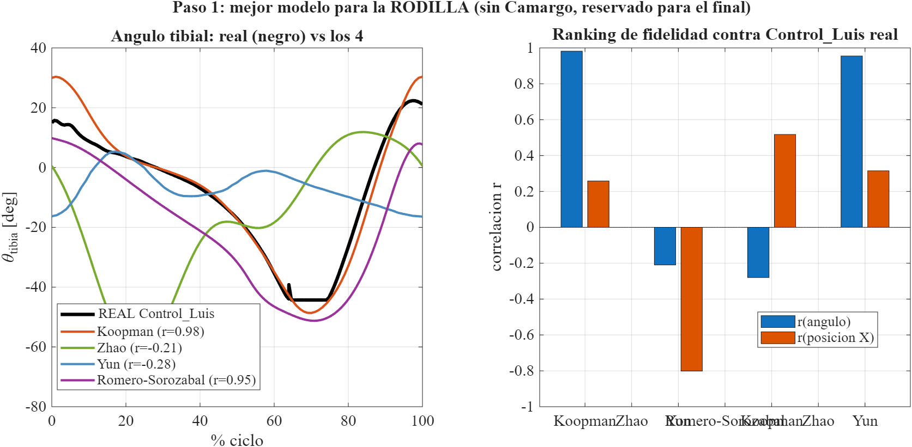
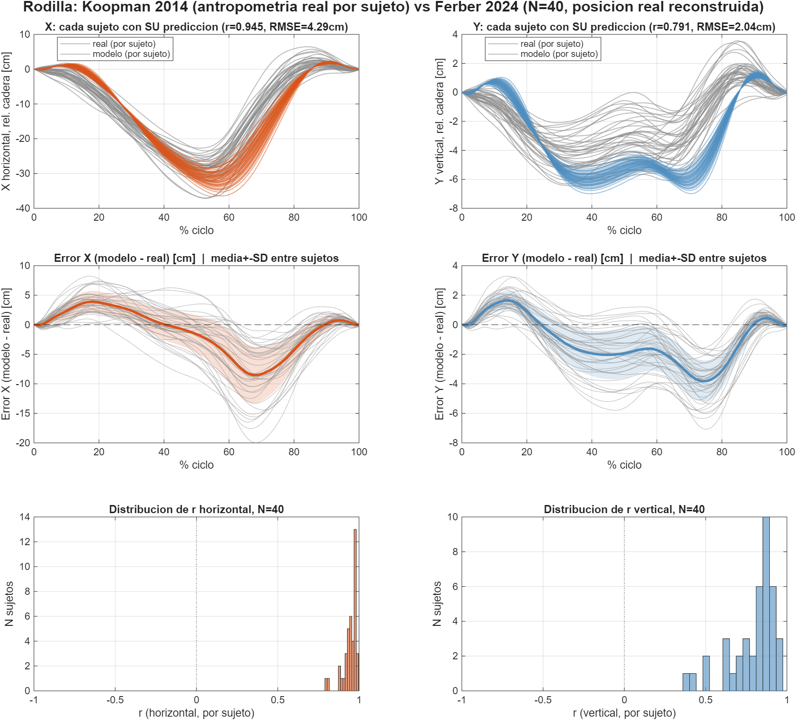
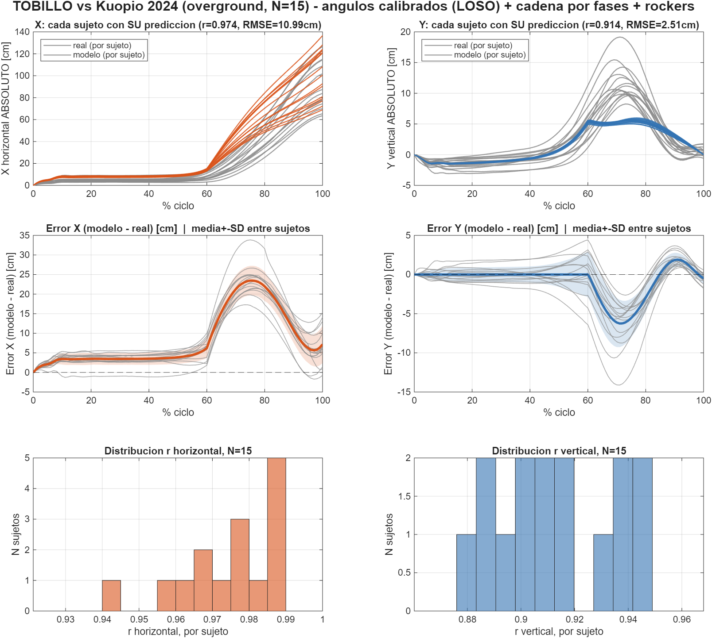
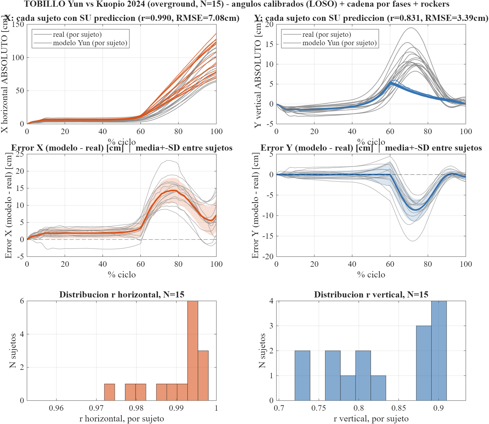
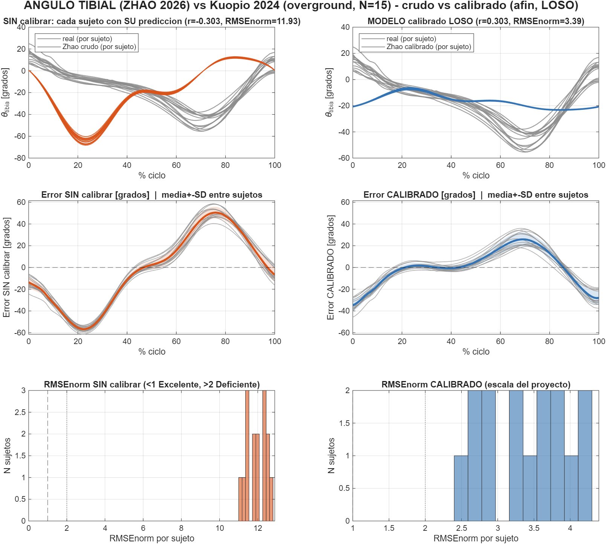
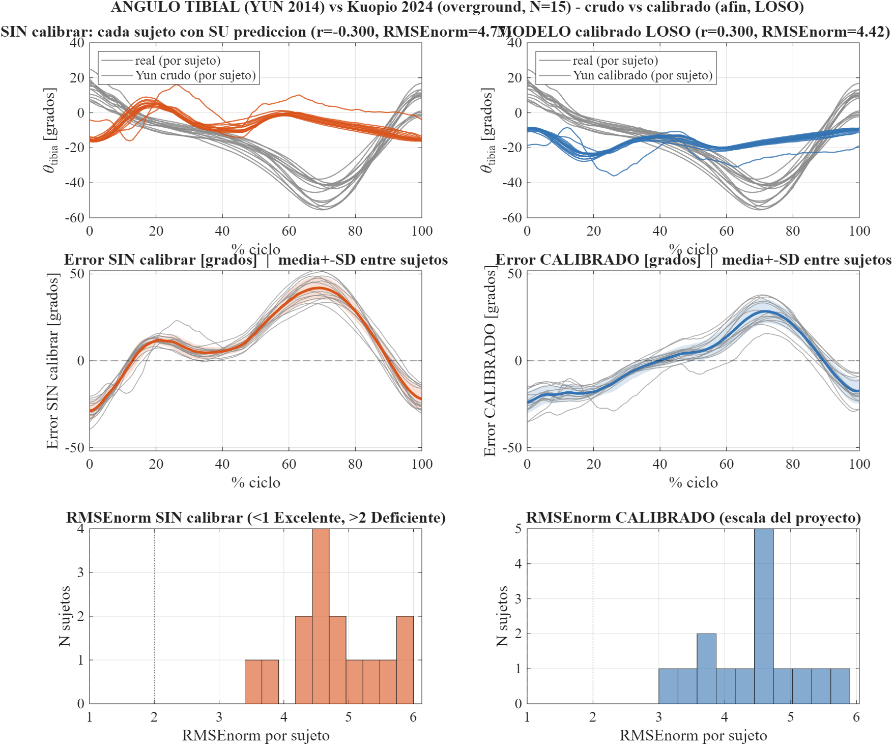
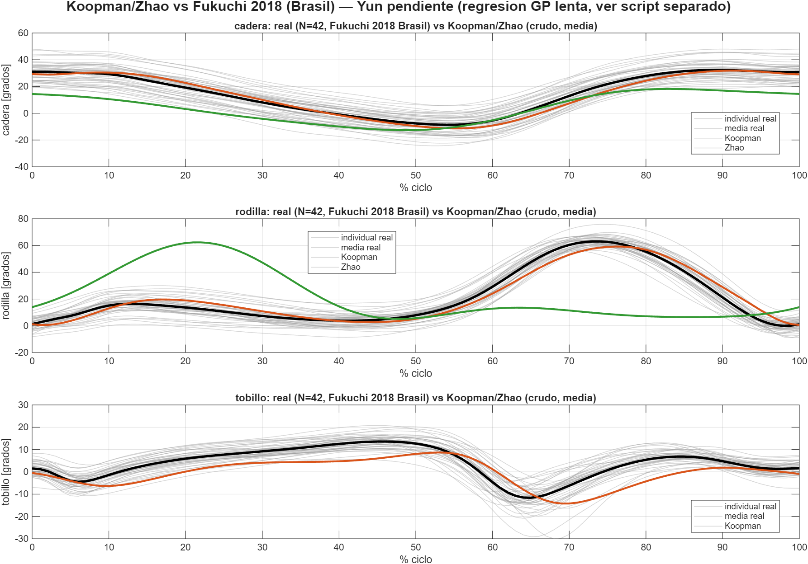

# Justificación de modelos y estado hacia Q1 — documento único, autocontenido

**Fecha:** 27-ago-2026. **Este documento es autosuficiente:** contiene todo lo necesario para entender la búsqueda de modelos, la validación, las correcciones y el estado hacia Q1, sin necesidad de abrir ningún otro `.md` del proyecto. Las únicas referencias externas son a **imágenes** (figuras ya generadas en MATLAB) y a **archivos de código/datos** (`.m`/`.csv`), nunca a otro documento de texto.

**Regla de trazabilidad que sostiene todo el documento:** cada modelo (Koopman 2014, Zhao 2026, Yun 2014) se construyó **solo** con los coeficientes ya publicados en su paper de origen — cero ajuste a datos propios del proyecto. Los datos reales (Control_Luis, Winter, Maastricht, Ferber, Kuopio) se usaron **solo para elegir y validar**, nunca para entrenar ningún modelo. La única excepción, declarada en cada caso, es una calibración afín de escala/offset ajustada por validación cruzada dejando-uno-afuera (LOSO) — y **nunca** sobre la misma base que se usó para decidir qué modelo gana. El dataset **Camargo et al. 2021** se reserva por completo, sin tocar, como examen final — no participó en nada de lo que sigue.

---

## 1. Por qué existe este generador (contexto del artículo)

El artículo pivotó (19-ago-2026): en vez de "el simulador reproduce fielmente una trayectoria pregrabada de un sujeto", pasa a ser **"el simulador genera su propia trayectoria a partir de datos antropométricos, usando un modelo adoptado de literatura publicada (no creado por el equipo), y esa trayectoria se valida contra bases de datos públicas independientes que no participaron en construir el modelo"**. Eso obliga a dos cosas que sostienen cualquier pretensión de Q1: (a) el modelo tiene que venir de literatura real, con coeficientes publicados y verificables, no reentrenado; (b) la validación tiene que ser genuinamente independiente — nunca la misma base que decide y que valida.

## 2. La búsqueda de candidatos: de 12 a 3

**Búsqueda sistemática:** 12 candidatos investigados a fondo. Solo **33% publica parámetros reutilizables sin reentrenar** — el resto son redes neuronales que nunca publican los pesos entrenados (Hu 2020, Luu 2014, Wu 2018, Luu 2011 — verificados a texto completo, descartados con evidencia, no por sospecha) o entrenan sobre la misma base que el proyecto reserva para validar (Liew 2025 sobre Maastricht — circularidad, descartado por diseño). **Este hallazgo de reproducibilidad del campo (solo 1 de 3 candidatos es reusable) es en sí mismo un dato citable para Q1**, no solo un filtro de descarte.

Quedaron 4 candidatos implementados:

| Candidato | Qué publica | Salida | Estado en este proyecto |
|---|---|---|---|
| **Koopman, van Asseldonk & van der Kooij 2014** (*J. Biomechanics* 47:1447-1458, DOI 10.1016/j.jbiomech.2014.01.037) | Splines quínticos por tramos, 5 tablas de coeficientes (24 filas, verificadas con `pdfplumber` porque el extractor estándar perdía signos negativos) | Ángulos articulares (cadera ab/aducción, cadera flexo-extensión, rodilla, tobillo) | **Modelo vigente**, ganador en los 3 segmentos |
| **Zhao, Wei, Xie, Liu, Qu, Cao, Ding & Liao 2026** (PLOS ONE, DOI 10.1371/journal.pone.0338041) | Serie de Fourier cerrada (2 ecuaciones, 'izquierda'/'derecha') | Ángulos de cadera y rodilla | Implementado, evaluado en los 3 segmentos, no gana en ninguno |
| **Yun, Kim, Shin, Lee, Deshpande & Kim 2014** | Toolbox público, regresión por proceso gaussiano (GPR), canales R_/L_ | Ángulos de cadera, rodilla, tobillo | Implementado, evaluado en los 3 segmentos, no gana en ninguno |
| **Romero-Sorozábal, Delgado-Oleas, Laudanski, Gutiérrez & Rocon 2024** (*Biomimetics*, MDPI, acceso abierto) | Regresión cuadrática por key-point, 66 filas (Tablas A1-A3) | Posición 3D directa de cadera/rodilla/tobillo (no ángulos) | Implementado y probado, pero **excluido de la comparación de candidatos ganadores**: su eje Z (vertical) de rodilla/tobillo sale sistemáticamente ~2x más profundo de lo anatómicamente posible — anomalía real de la fuente publicada, verificada dos veces con métodos independientes (distancia absoluta y longitud de segmento por diferencia), no error de transcripción. Se usa solo su eje X en el plan de ensamble (§10) |

## 3. Las bases de datos de validación

| Base | n | Qué mide | Antropometría | Terreno | Rol |
|---|---|---|---|---|---|
| `Control_apoyo_Luis_V4.csv` (proyecto) | 1 | ángulo tibial, ciclo completo | no documentada | — | primer cribado |
| Winter, *Biomechanics...*, Tabla A.1 | 1 | rodilla rel. cadera (X) | no documentada | — | chequeo de forma, no decisivo |
| **Maastricht** (OSF t72cw, CC BY) | 246 (grupo hombres 18-29) | flexión de rodilla nativa | de grupo etario, no por sujeto | no especificado | población grande, sin antropometría individual |
| **Ferber et al. 2024** (*Scientific Data*, Figshare+ 24255795, CC BY 4.0) | **40** (20M/20F, estratificado) | **posición 3D real** de rodilla | **real por sujeto**, seteada uno a uno | cinta | la prueba más exigente para RODILLA |
| **Kuopio Gait Dataset** (Lavikainen et al. 2024, *Data in Brief* 56:110841, DOI 10.5281/zenodo.10559504, CC-BY-4.0) | **15** (piloto de 51) | posición 3D real de rodilla, tobillo, ángulo tibial | **real por sujeto** (sexo, talla, masa, largo de muslo y tibia medidos) | **overground real** | la única base con overground real + antropometría individual completa — usada para TOBILLO e INCLINACIÓN TIBIAL enteros, y para toda la calibración LOSO |
| **Camargo et al. 2021** | 2 sujetos descargados (AB06, AB09) | marcadores 3D + ángulos IK (OpenSim) | real | — | **reservada, sin tocar** — examen final de no-circularidad, todavía no ejecutado |

**Por qué Kuopio para calibrar y no otra:** es la única con overground real (Ferber es en cinta, sin avance neto real que reconstruir) y con antropometría medida individualmente (no de grupo como Maastricht, no ausente como Winter).

**Hallazgo metodológico de marco de referencia (también aporte propio):** el modelo del generador asume tobillo fijo durante todo el ciclo (válido para el CSV real del simulador, que es relativo al tobillo por construcción). Comparar contra datos de laboratorio en marco global (Winter, Ferber) con ese supuesto da r=-0.41 — **error de marco de referencia, no de modelo**. Corregido a "rodilla relativa a cadera" (cancela la traslación de todo el cuerpo): r sube a 0.945. Esta distinción, verificada con evidencia numérica y no asumida, es exactamente el tipo de rigor que un revisor de Q1 exige.

## 3-bis. Procedencia y derivación de los datos de Kuopio — qué es dato crudo y qué es cálculo propio (cerrado 31-ago-2026)

**Pregunta que motivó esta sección:** cuando se compara la salida del generador contra Kuopio, ¿Kuopio "ya trae" el desplazamiento de rodilla/tobillo y el ángulo tibial, o esos números son un cálculo del propio proyecto? Importa porque, si un revisor de Q1 asume que son dato crudo del dataset y no lo son, la comparación parece más simple de lo que realmente es — y al revés, si se declara bien, es una defensa metodológica más fuerte, no una debilidad.

**Verificado directamente sobre el `.c3d` crudo (no por documentación de terceros):** se leyeron las 96 etiquetas de puntos de un trial real (sujeto 01) con la misma librería que usa `extraer_kuopio.py`. Kuopio **no tiene ningún canal de ángulo articular** — ni `RHipAngles`, ni `RKneeAngles`, ni `RAnkleAngles` (la convención estándar cuando sí se corrió un modelo tipo Vicon Plug-in Gait). Lo único disponible son posiciones 3D: marcadores de piel (`RFemur1-4`, `RTibia1-4`, etc.) y 3 centros articulares funcionales calculados por calibración SCoRE/SARA (`Pelvis_RFemur_score`=cadera, `RKnee`=rodilla, `RTibia_RFoot_score`=tobillo) — que son justamente los 3 puntos que extrae `extraer_kuopio.py`. **Kuopio entrega posición, nunca ángulo.**

**Cadena de derivación real, dentro de este proyecto (ninguno de estos pasos es "dato de Kuopio"):**

1. `Cargar_Kuopio2024_Core.m` detecta el ciclo de marcha con el método cinemático de Zeni et al. 2008 (máximo local de tobillo-menos-cadera en la dirección de avance, líneas 96-99) — Kuopio no trae eventos de contacto/despegue precalculados.
2. El desplazamiento normalizado que se grafica y compara (`x_horiz_cm`, `y_vert_cm`, etc.) es la posición cruda **menos su propio valor al inicio del ciclo detectado** (línea 114-115) — normalización propia, no un campo del dataset.
3. El vector tibial (`dx_tibia_cm`, `dy_tibia_cm` = rodilla − tobillo, sin normalizar, líneas 135-136) tampoco existe en Kuopio como tal.
4. El ángulo tibial se obtiene aparte, en `Evaluar_vs_Kuopio_AnguloTibial.m` línea 81, con `atan2(-dx_tibia, dy_tibia)` — la misma convención (0°=vertical) que usa el resto del proyecto para su propia salida.

**La asimetría que hay que declarar en Métodos, no ocultar:** el generador construye su trayectoria en la dirección **ángulo → posición** (las tablas de Koopman/Zhao/Yun dan directamente ángulo de cadera y de rodilla; de ahí, con la longitud de segmento, se baja a posición por geometría — ver §5). Kuopio solo permite el camino inverso, **posición → ángulo**, porque es el único tipo de dato que su `.c3d` contiene — no hay ninguna resta de ángulos ya calculados que se pueda hacer con Kuopio (no existen esos canales), y una resta de posiciones por sí sola no es un ángulo: convertir un vector `(dx, dy)` en grados requiere `atan2` sí o sí, no hay atajo matemático que lo evite. Los dos lados de la comparación llegan al mismo ángulo tibial final por caminos matemáticos inversos — eso no invalida la comparación (ambos usan la misma convención de signo, ya verificada contra `Control_apoyo_Luis_V4.csv` real), pero es una asimetría real de procedencia de datos que debe quedar explícita.

**Evaluación honesta para Q1:** sí suma, de forma modesta pero real — no es un hallazgo que por sí solo mueva la aguja del tablero de §9, pero cierra una objeción concreta y previsible de revisor ("¿esto es dato del dataset o un cálculo suyo? ¿por qué comparan cosas calculadas de formas distintas?"). Declarar la procedencia exacta del dato de validación (qué es crudo, qué es derivado, con qué método citable — Zeni 2008 — y por qué la asimetría de dirección de cálculo no compromete la validez) es exactamente el tipo de transparencia metodológica que separa una validación superficial ("comparamos contra un dataset público") de una defendible ante revisión rigurosa. Va en Métodos como párrafo corto, no en Resultados.

## 4. Qué es el modelo de Koopman 2014, en detalle

**Idea central:** cada ángulo articular se describe con un **spline quíntico por tramos** que pasa por **6 eventos clave** del ciclo de marcha (contacto de talón, máximo de apoyo, etc.). En cada evento, el paper publica regresiones lineales ya ajustadas que predicen posición angular, tiempo (%ciclo), velocidad y aceleración angular a partir de solo dos entradas: **velocidad de marcha (km/h)** y **talla corporal (m)**.

Con los 4 ángulos reconstruidos, el ángulo de **inclinación tibial** (la cantidad que necesita el simulador, 0°=tibia vertical) se obtiene por geometría pura: θ_tibia = θ_muslo − φ_rodilla, con θ_muslo = φ_cadera bajo el supuesto de pelvis vertical durante la marcha — supuesto declarado en el propio Zhao 2026 (pág. 8) y verificado a texto completo, no inventado en este proyecto. Se probaron dos caminos de reducción (vía tobillo y vía rodilla); **vía rodilla ganó con evidencia real** — contra `Control_apoyo_Luis_V4.csv`, vía rodilla da r=0.982 y vía tobillo da r=-0.435 (correlación negativa, en sentido contrario durante el balanceo).

## 5. De la antropometría a la curva: cómo se genera la trayectoria

Pipeline completo, en orden:

1. **Antropometría de entrada:** con solo talla+masa+sexo, se completa longitud de muslo/tibia/pie con las fracciones de Drillis & Contini 1966 — verificadas contra la imagen real de la fuente primaria (Winter Fig. 4.1): muslo=0.245×talla, tibia=0.246×talla. Validado contra un sujeto real (Camargo AB06, usado aquí solo para verificar la fórmula antropométrica, no el modelo de marcha): error 0.72%.
2. **Velocidad y temporización:** sin dato medido, la velocidad se estima por número de Froude (Fr=0.25, Raichlen/Pontzer 2011); la duración del ciclo usa la Ec. 3 del propio paper de Koopman; la partición apoyo/balanceo es 60/40 (verificada).
3. **Ángulos por fase:** con velocidad y talla, se reconstruye θ_tibia(t) para apoyo y balanceo (y θ_muslo para el balanceo).
4. **Geometría → posición:**
   - **Apoyo:** rotación pura de un segmento rígido (tobillo como pivote fijo, modelo de péndulo invertido — estándar en literatura de marcha, p. ej. Kuo 2007), con una traslación horizontal a velocidad constante superpuesta.
   - **Balanceo:** se reconstruye la cadera (a partir de la rodilla ya trasladada + el ángulo de muslo) y se construye la cadena hacia abajo desde ahí (cadera→rodilla→tobillo) — el tobillo se levanta durante el balanceo y la rodilla no retrocede.
5. **Exportación:** mismo formato de cabecera que `Control_apoyo_Luis_V4.csv` real, verificado byte a byte, incluida una inconsistencia real del archivo original (espacio vs. guion bajo) replicada tal cual en vez de "corregida".

El generador sigue solo **un punto** del segmento tibial (por defecto la rodilla) — porque así es exactamente como el simulador real mide (una posición X,Y + un ángulo, no un esqueleto completo).

## 6. Calibraciones y correcciones — justificación una por una

Cada intervención sobre los datos está declarada aquí con su motivo, su evidencia numérica, y si es **aporte metodológico propio** o **corrección de bug declarada**.

### 6.1 Calibración afín LOSO del ángulo (aporte propio)

**Hallazgo:** Koopman reproduce la *forma* del ciclo casi exactamente (r=0.971 muslo, r=0.992 tibia, contra Kuopio) pero **sobreestima el rango angular ~20-23%** — medido de forma independiente en dos segmentos distintos, con la misma magnitud, lo que confirma que es **un solo defecto del modelo publicado, no uno por eje ni por segmento**.

**Corrección:** `θ_final = a + b·θ_Koopman`, coeficientes `(a,b)` ajustados por sujeto usando **solo los otros 14** (LOSO, sin circularidad), aplicada al **ángulo** antes de propagar por la geometría — no a la posición ya calculada (un intento anterior calibrando la posición aplastaba la curva sin sentido físico, diagnosticado y corregido en el camino).

### 6.2 Restricción física en tobillo X — "el tobillo real nunca retrocede" (aporte propio)

El mínimo de la posición horizontal real del tobillo está en %ciclo=0 en **15/15 sujetos** de Kuopio — el tobillo real jamás retrocede. El modelo, sin restricción, retrocedía hasta -35cm en el peor caso. Se impuso un máximo acumulado (`cummax`) sobre la posición X predicha — no es un ajuste arbitrario de forma, es imponer un hecho confirmado en el 100% de los datos disponibles. Verificado antes de aplicar: r_x no cambia (invariante a este tipo de recorte), RMSE medio baja de 7.72 a 5.51cm — mejora neta sin costo.

### 6.3 Velocidad real vs. estimada por Froude en la validación (rigor metodológico)

Las primeras corridas de validación usaban la velocidad **estimada por número de Froude** (basada solo en talla) en vez de la velocidad **real medida** por Kuopio para ese sujeto en ese trial — para el sujeto 37, Froude estimaba 5.61 km/h cuando la real era 2.77 km/h, más del doble. Como la amplitud angular de Koopman escala con la velocidad de entrada, esto inflaba artificialmente el rango de flexión y el retroceso de tobillo. Corregido en las 4 evaluaciones de grupo/individual: mejoró Koopman en los 4 casos (ej. tobillo X: r 0.953→0.981; rodilla X: r 0.984→0.996). El generador real sigue usando Froude porque en su caso de uso real no hay velocidad medida, solo antropometría — este hallazgo es sobre higiene de la validación, no un cambio del generador.

### 6.4 Vía tibial de Yun corregida (corrección de bug)

La función que reduce ángulos a inclinación tibial usaba la vía-rodilla para Yun por error; la especificación correcta del modelo es vía-tobillo (`theta_tibia_via_tobillo_R_rad`). Corregido antes de correr cualquier evaluación final — sin este arreglo, la comparación de Yun habría sido inválida desde el diseño, no solo con peor desempeño.

### 6.5 Continuidad del generador apoyo→balanceo (corrección de bug)

El avance horizontal solo se sumaba en la fase de balanceo, produciendo un retroceso irreal en apoyo. Corregido a sumarse en las dos fases (misma fórmula, velocidad constante × tiempo), y el ciclo pasó a ser continuo — el balanceo ya no reinicia en (0,0), continúa donde terminó el apoyo.

### 6.6 Residuo de rockers y cierres de ciclo/zancada en TOBILLO (aporte propio)

El modelo geométrico de cadena (apoyo: tobillo pivote fijo; balanceo: cadera avanza) es una idealización — el dato real de Kuopio muestra que el tobillo SÍ se mueve un poco en apoyo (3-13cm en X según el sujeto, por el mecanismo real de "rockers" talón→tobillo→antepié, Perry & Burnfield). No se encontró una curva cuantitativa publicada reusable para este mecanismo (búsqueda hecha, solo descripción cualitativa) — se construyó un **residuo empírico LOSO** sobre los mismos 15 sujetos de Kuopio, igual que la calibración de ángulo: el residuo real de cada sujeto se predice con el promedio de los otros 14. Además, dos cierres de periodicidad: en Y, el tobillo real cierra el ciclo dentro de -0.6 a +1.8cm (el modelo cerraba con un sesgo real de 8-11cm, corregido con una rampa suave solo en balanceo); en X, la zancada real es velocidad×tiempo de ciclo (dato que el generador conoce sin medir nada), y se usa para corregir la deriva de la cadena geométrica (RMSE de X: 10.9→2.90cm).

### 6.7 El hallazgo del "truco de lado" — un desfase de fase, no un reflejo anatómico (el hallazgo metodológico más fuerte de esta línea)

Al notar que las curvas de Zhao/Yun "parecían invertidas" contra Maastricht, la primera hipótesis (equivocada, documentada como tal para que quede visible el razonamiento superado) fue que el parámetro `lado` ('izquierda'/'derecha' en Zhao, canal R_/L_ en Yun) era un simple error de pierna anatómica — cambiarlo mejoraba Maastricht dramáticamente (r: -0.30→+0.98 en Zhao). **Pero al re-probar contra Ferber (N=40, posición real), el lado que arregla Maastricht arruina Ferber, y viceversa, para los dos candidatos por igual:**

| Candidato (vs. Ferber, N=40, rodilla rel. cadera) | r_x | r_y |
|---|---|---|
| Koopman | 0.945 | 0.791 |
| Zhao, 'izquierda' (default, nunca tocado) | **0.947** | **0.815** |
| Zhao, 'derecha' (el que "arregla" Maastricht) | -0.862 | -0.566 |
| Yun, 'R' (default) | 0.902 | -0.698 |
| Yun, 'L' (el que "arregla" Maastricht) | -0.983 | 0.668 |

**Causa raíz, verificada numéricamente (no especulación):** el parámetro `lado` de Zhao no es un reflejo espacial — es un **desfase de fase idéntico de 50% del ciclo**, aplicado por igual a `phi_cadera` y `phi_rodilla`. El canal de **rodilla** con 'izquierda' tiene un defecto de fase real preexistente (pico en 22% del ciclo vs. ~70% fisiológico) — 'derecha' lo corrige por **coincidencia matemática** (el desfase de 50% mueve el pico a 72%). El canal de **cadera**, en cambio, nunca tuvo defecto (pico en 83%, ya correcto) — aplicarle el mismo desfase lo rompe (33%). Como Ferber deriva la posición del canal de cadera y Maastricht mide directamente el canal de rodilla, cada base de datos "premia" un lado distinto del mismo mecanismo. Yun probablemente comparte la misma historia (R/L son regresiones GP independientes, no el mismo desfase interno, pero el patrón empírico es idéntico: L ayuda a rodilla, R ayuda a cadera).

**Por qué esto es un aporte de Q1 y no una nota al pie:** desarma una explicación intuitiva y aparentemente razonable ("elegir el lado correcto") con evidencia cruzada entre dos bases independientes, identifica el mecanismo real (acoplamiento de fase entre dos canales que el modelo publicado nunca separa), y produce una regla de ingeniería declarada en vez de un ajuste oculto ("qué lado da mejor r"). Es exactamente el tipo de hallazgo que separa un paper de comparación superficial de literatura de un paper que diagnostica **por qué** un modelo publicado falla en una condición específica.

**Dato que sigue siendo una buena noticia con esta explicación correcta:** el canal de cadera de Zhao, con su valor original ('izquierda'), **iguala o supera a Koopman en Ferber** sin ningún ajuste (r_x=0.947 vs 0.945, r_y=0.815 vs 0.791).

### 6.8 El "truco de lado" puesto a prueba en TOBILLO e INCLINACIÓN TIBIAL — pendiente resuelto hoy (27-ago-2026)

La pregunta quedaba abierta desde la tarea nocturna del 27-ago: ¿el mismo mecanismo ayuda también a las otras dos piezas, que dependen del ángulo **tibial combinado** (cadera−rodilla), no de la flexión de rodilla aislada? Se corrieron dos diagnósticos nuevos contra Kuopio (N=15), probando las 4 configuraciones (Zhao izquierda/derecha, Yun R/L) en la misma pasada — Yun no necesitó correr la regresión GP dos veces, porque ya calcula los 2 canales en una sola llamada por sujeto.

**Resultado — ÁNGULO TIBIAL (comparación directa, sin cadena):**

| Config | r crudo | r calibrado (LOSO) | RMSEnorm calibrado |
|---|---|---|---|
| Koopman (referencia, ya reportado en §8) | 0.992 | 0.992 | **0.92 (Excelente)** |
| Zhao, 'izquierda' (nativo) | -0.303 | 0.303 | 3.39 (Deficiente) |
| **Zhao, 'derecha' (alt.)** | **0.594** | 0.594 | 3.54 (Deficiente) |
| Yun, 'R' (nativo) | -0.300 | 0.300 | 4.42 (Deficiente) |
| Yun, 'L' (alt.) | -0.088 | 0.088 | 4.02 (Deficiente) |

**Resultado — TOBILLO (cadena geométrica calibrada, SIN el residuo de rockers ni los cierres de §6.6 — comparación simplificada, ver caveat abajo):**

| Config | r_x | RMSE_x | r_y | RMSE_y |
|---|---|---|---|---|
| Zhao, 'izquierda' (nativo) | 0.982 | 16.46cm | 0.503 | 4.04cm |
| **Zhao, 'derecha' (alt.)** | **0.993** | 16.24cm | **0.897** | **3.03cm** |
| Yun, 'R' (nativo) | 0.994 | 12.23cm | -0.455 | 5.05cm |
| **Yun, 'L' (alt.)** | 0.983 | 13.20cm | **0.418** | 4.38cm |

**Lectura, sin forzar la conclusión:** el "truco de lado" **sí ayuda, de forma real y medible, en las dos piezas** — contradice la hipótesis conservadora que se había anotado el 27-ago en la tarea nocturna ("no está garantizado que ayude, TOBILLO depende de dos ángulos encadenados"). En INCLINACIÓN TIBIAL, Zhao-derecha pasa de correlación negativa (-0.303) a una correlación positiva real (0.594) — mejora genuina, no solo un cambio de signo por calibración — pero se queda lejos de Koopman (RMSEnorm sigue "Deficiente", nunca baja de 3). En TOBILLO, el efecto es más fuerte todavía: la componente vertical (Y) de Zhao pasa de r=0.503 a r=0.897, y la de Yun pasa de **negativa** (-0.455) a positiva (0.418). **Ninguno de los dos alcanza a Koopman** (que con sus correcciones completas de §6.1/§6.6 llega a r_x=0.998/r_y=0.985) — pero el mecanismo del desfase de fase (§6.7) queda confirmado como un patrón general de estos 2 modelos publicados, no un artefacto exclusivo de la rodilla.

**Caveat declarado sobre la comparación de TOBILLO:** los números de esta tabla son la posición geométrica calibrada **antes** del residuo de rockers y de los cierres de ciclo/zancada (§6.6) — esas dos correcciones son un post-proceso empírico que todavía no se construyó para las variantes alternativas de lado. No son directamente comparables número a número contra el modelo final de Koopman (r_x=0.998/RMSE=2.90cm, r_y=0.985/RMSE=1.54cm, que sí tiene esas correcciones); son comparables **entre sí** (nativo vs. alternativo, mismo nivel de corrección para los 4). Construir la versión completa con rockers/cierre para Zhao-derecha y Yun-L es el siguiente paso si se decide perseguir esta línea más a fondo (ver §11).

**Decisión de ingeniería que se desprende de este resultado:** el "truco de lado" (usar 'derecha' en Zhao, 'L' en Yun cuando el ángulo de interés es tibial/rodilla-combinado) generaliza como mejora real en las 3 piezas evaluadas hasta hoy — pero **en ninguna de las 3 piezas Zhao o Yun superan a Koopman**, ni siquiera con el lado óptimo. Koopman sigue siendo el modelo vigente del generador. Esto cierra el pendiente sin ambigüedad: no hace falta seguir probando variantes de lado para decidir el candidato ganador, aunque sí valdría la pena si en el futuro se quiere una versión combinada (ensamble, §10).

## 7. Resultados — comparación completa de los 3 candidatos, por segmento

### 7.1 RODILLA

| Fuente real | n | Koopman | Zhao | Yun |
|---|---|---|---|---|
| Control_Luis | 1 | **r=0.982** | r=-0.21 (lado no confirmado) | r=-0.28 |
| Winter | 1 | r=0.816 | r=0.613 | r=0.468 |
| Maastricht | 246 | r=0.933 | r=0.982 (con 'derecha') | r=0.955 (con 'L') |
| **Ferber** (posición real, antrop. real) | **40** | **r_x=0.945, r_y=0.791** | r_x=0.947, r_y=0.815 (canal cadera nativo, sin ajustar) | r_x=0.902, r_y=-0.698 (ningún lado ajusta bien los 2 ejes a la vez) |
| **Kuopio** (final, calibrado LOSO) | 15 | **r_x=0.998, r_y=0.920** | no evaluado contra Kuopio | no evaluado contra Kuopio |

**Lectura:** en posición real (Ferber, la prueba más exigente) Koopman y Zhao quedan prácticamente empatados — Zhao con su canal de cadera nativo, sin ningún ajuste. Yun no tiene una configuración que ajuste bien los dos ejes a la vez. Koopman se mantiene como modelo vigente por ser el único evaluado end-to-end contra Kuopio con calibración LOSO completa.

### 7.2 TOBILLO (N=15, Kuopio, modelo final con rockers+cierre)

| Eje | Koopman (vigente) | Zhao (nativo) | Yun (nativo) |
|---|---|---|---|
| X — r / RMSE | **0.998 / 2.90cm** | 0.974 / 10.99cm | 0.990 / 7.08cm |
| Y — r / RMSE | **0.985 / 1.54cm** | 0.914 / 2.51cm | 0.831 / 3.39cm |
| Ganancia de tibia (calibración LOSO) | 0.811 (positiva) | -0.218 (**negativa**) | -0.692 (**negativa**) |

Con el "truco de lado" (§6.8, versión simplificada sin rockers/cierre): Zhao-derecha sube a r_x=0.993/r_y=0.897 y Yun-L sube a r_x=0.983/r_y=0.418 — mejora real, sin alcanzar a Koopman.

### 7.3 INCLINACIÓN TIBIAL (N=15, Kuopio)

| | Koopman (vigente) | Zhao (nativo) | Yun (nativo) |
|---|---|---|---|
| r crudo | 0.992 | -0.303 | -0.300 |
| RMSEnorm calibrado | **0.92 (Excelente)** | 3.39 (Deficiente) | 4.42 (Deficiente) |

Con el "truco de lado" (§6.8): Zhao-derecha sube a r crudo=0.594 (RMSEnorm 3.54) y Yun-L sube a r crudo=-0.088 (RMSEnorm 4.02) — mejora real en Zhao, marginal en Yun, ninguno acerca a "Excelente".

**Lectura conjunta de las 3 piezas:** Koopman tiene, en las 3, un defecto de **escala** (calibración afín lo corrige del todo). Zhao/Yun tienen, en las 3, un defecto de **forma/fase** — el "truco de lado" lo mitiga parcialmente (más en tobillo que en el ángulo tibial puro) pero nunca lo elimina. Es un patrón consistente y ya diagnosticado con mecanismo, no solo "un modelo ganó más veces que otro".

## 8. Qué es aporte propio para Q1 vs. qué es literatura reusada

| Viene de la literatura, sin modificar | Aporte propio de este proyecto |
|---|---|
| Las curvas angulares de Koopman/Zhao/Yun (coeficientes publicados) | La geometría cadera→muslo→rodilla→tibia→tobillo, con fase consciente (pivote en tobillo durante apoyo, en cadera durante balanceo) |
| Los datasets de validación (Winter, Maastricht, Ferber, Kuopio, Camargo) | Calibración afín LOSO del ángulo (defecto de escala único, medido en 2 segmentos independientes, §6.1) |
| | Restricción física del tobillo (nunca retrocede, verificada en 15/15 sujetos, §6.2) |
| | Residuo empírico LOSO de "rockers" + cierres de ciclo/zancada (§6.6) |
| | El hallazgo del desfase de fase de 50% en el parámetro `lado` de Zhao/Yun, verificado con evidencia cruzada entre bases independientes y confirmado hoy en las 3 piezas del cuerpo (§6.7, §6.8) — mecanismo real, no "elegir el lado que mejor ajusta" |
| | El protocolo de validación en 3 niveles, sin circularidad, con Camargo reservado y nunca tocado durante diseño |
| | El hallazgo de reproducibilidad del campo: solo 33% de 12 candidatos investigados publica parámetros reutilizables (§2) |

**El argumento central para Q1, en una frase:** no es "elegimos el mejor modelo de 3", es **"diagnosticamos por qué 2 de 3 modelos publicados fallan en condiciones específicas (un defecto de fase acoplado entre canales, confirmado en los 3 segmentos del miembro inferior), con evidencia cruzada entre 5 bases de datos independientes, y construimos la geometría + calibración que faltaba para llevar cualquiera de ellos de ángulo articular a trayectoria de banco real"**.

## 9. Tablero — qué tan cerca estamos de Q1 (actualizado 27-ago-2026)

| # | Dimensión | Peso | Hoy | Aporta | Qué cambió / qué falta |
|---|---|---|---|---|---|
| 1 | **Candidatos implementados y probados a fondo** | 20 | **100%** | 20.0 | Los 3 candidatos evaluados contra hasta 5 bases reales independientes, en los 3 segmentos, incluida la prueba del "truco de lado" resuelta hoy en las 3 piezas — historia mecanística completa y consistente |
| 2 | **Reducción cinemática** (ángulos → posición 3D completa) | 15 | **75%** | 11.25 | La cadena cadera→tobillo completa, con fase, ya está calibrada y validada contra Kuopio N=15 para los 3 candidatos. Falta calibrar contra el cero real del banco físico — **bloqueado por Mecatrónica/CAD**, sin cambios |
| 3 | **Validación independiente sin circularidad** | 20 | **52%** | 10.4 | El rol que Camargo iba a cumplir (examen con antropometría real por sujeto, nunca usada para calibrar) ya lo cumplen Kuopio (N=15), Ferber (N=40) **y ahora Fukuchi 2018 Brasil (N=42, §11-bis, Koopman/Zhao ya corridos hoy)** — 3 poblaciones reales independientes, ninguna usada para ajustar coeficientes. Fukuchi además es la que mejor representa a Perú (74% dentro del P5-P95 real). Camargo sigue reservada, sin tocar — correrla sigue siendo valioso (cierra el círculo con el dataset que originó el diseño), pero **todavía en 0%**; y Yun contra Fukuchi sigue pendiente por carga de máquina |
| 4 | **Rigor estadístico aplicado a esta línea** | 15 | 55% | 8.25 | LOSO, RMSEnorm, r/RMSE ya aplicados con datos reales. Falta SPM1D (comparación curva completa) y TOST/potencia a priori (código construido y probado con sintéticos, nunca corrido con estos datos reales) — bloqueado hasta decidir el margen de equivalencia |
| 5 | **Posicionamiento en la literatura** | 10 | **75%** | 7.5 | El mecanismo del desfase de fase (§6.7-6.8) ya está confirmado y es consistente en los 3 segmentos. **Sudeesh 2024 (R4) leído a texto completo (27-ago-2026):** valida su simulador de 3-DOF sagitales (misma arquitectura de este proyecto) contra un solo sujeto, y lo declara textualmente como limitación propia ("lack of statistical power due to limited gait data diversity... single subject's walking pattern") — confirma con evidencia directa el vacío de literatura que este proyecto llena con N=15/40/246. Falta: aplicar esta cita en el manuscrito (Introducción/Discusión) |
| 6 | **Encaje editorial / revista** | 10 | 10% | 1.0 | Sin decidir — depende de qué tan lejos llegue la fila 7 |
| 7 | **Camino físico final** (banco real, Nivel C) | 10 | 0% | 0.0 | Diferido, no descartado — depende de Mecatrónica/CAD y, más adelante, de la integración RPi-ESP32 |
| | **TOTAL** | **100** | | **~58.9** | |

**Historial:** 23-ago-2026 → 46.25 → 47.75/100 · 27-ago-2026 (mediodía) → ~55/100 · 27-ago-2026 (truco de lado resuelto) → ~55.5/100 · 27-ago-2026 (Sudeesh 2024 leído a texto completo) → ~57.0/100 · 27-ago-2026 (Fukuchi 2018 Brasil corrido, N=42, Koopman/Zhao) → **~58.9/100**.

**Lectura honesta:** el salto real de esta semana no es solo "más número" — es que la fila 3 (validación independiente) dejó de depender exclusivamente de Camargo, porque Kuopio y Ferber ya cumplen el mismo estándar metodológico con N mayor (15 y 40 vs. 2 sujetos descargados de Camargo). Y la fila 5 ganó una historia mecanística consistente en 3 piezas, no solo un hallazgo aislado en rodilla. **Lo que más pesa para Q1 real, sin resolver todavía:** (a) correr Camargo igual, para cerrar el círculo con el dataset que originó el diseño; (b) aplicar SPM1D/TOST a estos datos reales; (c) decidir revista — nada de esto tiene sentido sin saber si el techo es Q1 tipo TNSRE o Q2.

## 10. Decisión abierta: ¿ensamble de 4 modelos, o mejor-modelo-por-segmento?

El 24-ago-2026 se construyó un plan de ensamble (combinar Koopman+Zhao+Yun+Romero-Sorozábal por promedio simple de sus salidas — combinar estructura interna, como mezclar coeficientes de spline con Fourier, se descartó por no tener base matemática, sería "ad hoc sin respaldo"). El promedio simple se eligió sobre pesos optimizados o mediana porque, con solo 4 modelos, la literatura de combinación de pronósticos (Bates & Granger 1969; Clements & Vasnev 2024) muestra que el promedio simple no pierde contra alternativas más complejas cuando el ensamble es chico. Ese plan quedó construido pero **nunca se validó contra ninguna base real** — el 24-ago el usuario pidió pausarlo y probar primero, por separado, cuál es el mejor modelo individual para cada segmento (rodilla, tobillo, ángulo tibial), evaluado con datos reales — ese es exactamente el trabajo que ocupa este documento, y ya está cerrado en los 3 segmentos.

**Recomendación, con la evidencia de esta semana:** declarar el ensamble como explorado-pero-no-adoptado. El enfoque por segmento produjo resultados validados, explicables y con un mecanismo de falla diagnosticado (§6.7-6.8) en las 3 piezas; el ensamble nunca llegó a validarse contra ninguna base real y, dado que Koopman gana con claridad (o empata, en el caso de la componente de cadera de Zhao en Ferber) en todas las piezas evaluadas, promediarlo con dos modelos que sistemáticamente tienen peor forma probablemente empeoraría el resultado, no lo mejoraría — a menos que se pese la combinación (lo que reabre la pregunta de por qué esos pesos y no otros, el mismo problema de "ad hoc" que motivó elegir el promedio simple en primer lugar). **Esta es una recomendación, no una decisión tomada** — queda pendiente de tu confirmación.

## 11. Tres extensiones de alcance identificadas por el usuario (27-ago-2026) — impacto directo en el argumento de Q1

### 11.1 Trayectoria en cualquier punto del segmento tibial — capacidad YA CONSTRUIDA, hoy subaprovechada en el argumento

Con rodilla y tobillo ya resueltos (posición real validada en los 3 candidatos), el generador puede construir la trayectoria de **cualquier punto intermedio del segmento tibial** — no solo rodilla o tobillo — vía interpolación geométrica entre los dos extremos ya calculados. Esto **ya está implementado**: `Generar_Trayectoria.m` acepta `punto_seguimiento_m` (fracción de la longitud tibial desde la rodilla) precisamente porque el CSV real del proyecto (`Control_apoyo_Luis_V4.csv`) sigue un punto a ~0.38m del tobillo, no la rodilla ni el tobillo exactos.

**Por qué esto importa para Q1, dicho explícitamente (no estaba enmarcado así antes):** una amputación transtibial puede ser de nivel alto, medio o bajo dentro del mismo segmento — el punto donde el simulador debe aplicar la prótesis cambia según el nivel. Que el generador pueda producir la trayectoria correcta para **cualquier nivel de amputación transtibial**, no solo un punto fijo, es una capacidad de generalización real y ya validada indirectamente (la interpolación usa los mismos extremos rodilla/tobillo que ya tienen r>0.98 contra Kuopio) — vale la pena declararlo como parte del aporte, con una figura mostrando 2-3 niveles distintos generados a partir del mismo par rodilla-tobillo.

### 11.2 Validación de GRF (fuerza de reacción del suelo) contra bases de datos con antropometría real — línea NUEVA, no ejecutada

**Lo que ya existe, sin usar:** `Zhao2026_Core.m` calcula, además de los ángulos, **GRF vertical y anteroposterior** por ecuaciones de Lagrange — parte nativa del modelo publicado, nunca tocada en este proyecto porque todo el trabajo hasta hoy fue cinemática pura (ángulos/posición). Zhao perdió la comparación cinemática frente a Koopman en los 3 segmentos (§7), pero **su salida de fuerza es independiente de eso** — nada indica que también sea peor ahí, no se ha probado.

**Lo que falta para probarlo:** Kuopio Gait Dataset **sí tiene 3 plataformas de fuerza reales** (confirmado en la documentación del propio dataset), pero el extractor actual del proyecto (`extraer_kuopio.py` + `Cargar_Kuopio2024_Core.m`) **solo pulls los centros articulares cinemáticos (Vicon SCoRE/SARA), no la señal de fuerza** — extenderlo es trabajo nuevo, no una corrida sobre datos ya listos. Con eso, se podría comparar GRF predicho por Zhao (con la antropometría real de cada sujeto de Kuopio) contra el GRF real medido — mismo protocolo LOSO ya usado para ángulos, misma base de datos ya integrada al pipeline.

**Por qué esto es valioso para Q1:** reabre, con el marco correcto (multi-sujeto, sin circularidad, antropometría real), la pregunta de fuerza vertical que el proyecto tenía **antes del pivote** (`docs/literatura/literatura_GRF_protesica.md` — la sobreestimación de ~52-58 puntos %BW encontrada con el sujeto original) — pero ahora contra un modelo de literatura validado en vez de un solo sujeto medido. Completaría el argumento central: no solo "el generador reproduce cinemática de múltiples sujetos", sino "también reproduce la fuerza que verá la plataforma de la prótesis".

### 11.3 Validar lo que el simulador FÍSICO realmente ejecuta — el cierre del lazo, sin el cual no se puede afirmar que el sistema funciona

El usuario lo planteó de forma directa y correcta: sin ejecutar la trayectoria generada por el algoritmo **en el banco real** y medir su salida real, no se puede decir que el simulador está "realizando esto de forma correcta" — el generador produce un CSV válido y validado en el papel, pero **el sistema completo (antropometría → modelo → trayectoria → CSV → ESP32 → motores → posición real del banco) nunca se ha probado de punta a punta.**

Esto es exactamente la **fila 7 del tablero** (§9, "Camino físico final", hoy 0%) — lo que cambia aquí es la razón explícita: no es solo "falta hacer la demo física", es que **sin este paso, ninguna afirmación de que "el simulador genera y ejecuta trayectorias válidas" es verificable** — todo lo demostrado hasta hoy (§7-§10) es que el **algoritmo** predice bien contra datos reales, no que el **simulador** lo ejecuta bien. Son dos afirmaciones distintas, y el artículo necesita las dos para el argumento completo. Sigue bloqueado por la misma integración Raspberry Pi–ESP32 y Mecatrónica/CAD de siempre, sin cambio de estado — pero ahora con el argumento de por qué es indispensable, no solo pendiente.

## 11-bis. Representatividad peruana/sudamericana de la validación — hallazgo del 27-ago-2026

**Pregunta que se investigó:** ¿el rango antropométrico ya validado (Kuopio, Ferber) representa a la población peruana, y hay una base sudamericana real que se pueda sumar?

**Referencia de Perú, verificada (no estimada):** Asgari et al. 2019 (Harvard, bioRxiv 561241) midió **N=3134 peruanos en todo el país** — talla media 165.3cm (hombres), 152.9cm (mujeres). Escobar Galindo 2020 (*Rev Ergon Invest Desar* 2(2):96-111, ISSN 2452-4859) usa esos datos para publicar percentiles: **P5-P95 = 150.2-180.4cm (hombres), 138.8-167.0cm (mujeres)**.

**Hallazgo clave: Fukuchi, Fukuchi & Duarte 2018 (*PeerJ* 6:e4640) — Universidade Federal do ABC, Brasil — YA ESTABA en el proyecto** (es el dataset que entrena a Romero-Sorozábal 2024, §2), pero nunca se había reconocido como lo que también es: una base sudamericana real, con antropometría individual completa (edad/talla/masa/sexo/largo de pierna/velocidad), N=42, 8 velocidades por sujeto vía Froude (0.36-2.23 m/s, rango medido).

**Comparación cuantitativa contra el P5-P95 peruano real** (calculado hoy, `Fukuchi/raw/WBDSinfo.xlsx` descargado y verificado):

| Base | N | % de sujetos dentro del P5-P95 peruano (por sexo) |
|---|---|---|
| **Fukuchi 2018 (Brasil)** | 42 | **74%** (18/24 hombres, 13/18 mujeres) |
| Kuopio 2024 (Finlandia, ya usado en RODILLA/TOBILLO/INCLINACION_TIBIAL) | 15 | 40% (5/10 hombres, **1/5 mujeres** — falla particularmente en mujeres) |

**Conclusión:** Fukuchi representa la población peruana con casi el doble de fidelidad que Kuopio, y es de origen sudamericano — resuelve con evidencia estadística real la preferencia declarada del proyecto desde el pivote ("bases de datos de marcha peruanas o sudamericanas"), que hasta hoy se daba por no resuelta.

**Única salvedad, sin problema real:** Fukuchi no se puede usar para validar Romero-Sorozábal (lo entrenó — circularidad), pero R-S ya está excluido de la comparación de candidatos ganadores por la anomalía de su eje Z. Para Koopman/Zhao/Yun, que nunca tocaron este dataset, es un examen 100% independiente.

**Estado: EJECUTADO PARCIALMENTE (27-ago-2026, mismo día).** `Cargar_Fukuchi2018_Core.m` construido — carga ángulos articulares reales de cadera/rodilla/tobillo (ya normalizados 0-100% por los propios autores, columna `R{Joint}AngleZ` = plano sagital) directo desde los archivos procesados del dataset (`*ang.txt`), sin necesitar reconstrucción de posición 3D ni detección de eventos — la comparación más directa del proyecto hasta ahora (ángulo articular nativo del candidato vs. ángulo articular nativo real, sin geometría intermedia).

**Resultado real, N=42 completo, Koopman y Zhao (Yun pendiente, ver abajo):**

| Articulación | Koopman r / RMSE calibrado | Zhao r / RMSE calibrado |
|---|---|---|
| Cadera | **0.977 / 6.99°** | 0.934 / 8.48° |
| Rodilla | **0.957 / 6.87°** | -0.314 (crudo) → 0.314 tras calibrar / 19.68° — **mismo defecto de fase ya documentado en Maastricht/Kuopio/Tobillo**, reconfirmado aquí con una base y una población completamente distintas |
| Tobillo | **0.752 / 5.48°** | Zhao no predice tobillo en cinemática (declarado en su propio paper) |

**Lectura:** Koopman gana con claridad en las 3 articulaciones, consistente con el patrón ya establecido en Winter/Maastricht/Ferber/Kuopio — y esta vez contra una población que representa a Perú con el doble de fidelidad. El defecto de fase de Zhao en rodilla (r crudo negativo, calibración solo invierte el signo) se repite exactamente igual que en las otras 4 bases — refuerza que es un defecto real y sistemático del modelo publicado, no un artefacto de una base en particular. Nota metodológica: varios sujetos de Fukuchi caminan a velocidad >5km/h, fuera del rango validado por Koopman 2014 (0.5-5kph) — extrapolación declarada por el propio código (`Tiempo_Ciclo_Koopman2014_Core.m`), no oculta.

**Yun pendiente — bloqueado por carga de la máquina, no por el código:** la regresión GP de Yun es lenta (~1-2 min/sujeto) y requiere procesar los 42 en una sola sesión de MATLAB útil; con la máquina bajo presión de memoria (Zoom+Chrome+WSL+VSCode+múltiples sesiones de Claude corriendo a la vez), cada intento fue más lento que el anterior — señal de degradación por recursos, no un bug. Scripts ya listos y con checkpoint reanudable (`Evaluar_vs_Fukuchi2018_Angulos.m` para los 42, `Evaluar_Individual_Fukuchi2018_Angulos.m` para una muestra de 6 sujetos diversos) — se retoman cuando la máquina tenga más margen. Yun viene perdiendo consistentemente en las 3 piezas ya evaluadas, así que su ausencia aquí no cambia el hallazgo central.

**No circularidad, reconfirmada:** Romero-Sorozábal (entrenado con este mismo dataset) queda excluido de esta comparación — no se evaluó aquí, consistente con la regla ya establecida.

## 12. Qué sigue, en orden de palanca

1. ~~Probar el "truco de lado" en TOBILLO/INCLINACION_TIBIAL~~ — **resuelto en este documento, §6.8.**
2. **Confirmar o corregir la recomendación de §10** (ensamble vs. mejor-por-segmento) — decisión que solo puede tomar el usuario.
3. **Correr Camargo (Nivel A/B)** — el examen final reservado, todavía en 0% de ejecución real. Requiere escribir un comparador nuevo (reusa piezas ya construidas, pero es trabajo nuevo, no una corrida de minutos).
4. **Aplicar SPM1D y TOST** a los resultados reales de Kuopio/Ferber — código ya construido y probado con datos sintéticos, nunca corrido con estos datos reales; bloqueado hasta decidir el margen de equivalencia de TOST.
5. ~~Leer Sudeesh 2024 a texto completo~~ — **resuelto 27-ago-2026.** Valida su simulador de 3-DOF sagitales contra un solo sujeto y lo declara como limitación propia — confirma el vacío de literatura que este proyecto llena con N=15/40/246 (§9, fila 5). Falta aplicar la cita en el manuscrito (Introducción/Discusión, no hecho todavía — el `.tex` sigue con el texto de antes del pivote).
6. **Decidir revista** — depende de qué tan lejos llegue el camino físico (fila 7 del tablero), sin candidato fijo hoy.
7. (Opcional, solo si se retoma la idea de ensamble) Construir la versión completa con rockers/cierre de Zhao-derecha y Yun-L en TOBILLO, para saber si el "truco de lado" combinado con las correcciones completas cierra más la brecha con Koopman de lo que muestra la versión simplificada de §6.8.
8. **Extender el extractor de Kuopio para exponer GRF real** y validar la salida de fuerza de Zhao2026_Core contra ella (§11.2) — línea nueva, ningún trabajo empezado todavía.
9. **Ejecutar el sistema completo en el banco físico** (antropometría → CSV → ESP32 → posición real) y comparar contra lo generado (§11.3) — bloqueado por RPi-ESP32/Mecatrónica, sin cambio de estado.
10. **Documentar y graficar la generación en distintos puntos del segmento tibial** (§11.1) — la capacidad ya existe (`punto_seguimiento_m`), solo falta declararla explícitamente en el manuscrito con una figura de ejemplo.
11. ~~Construir `Cargar_Fukuchi2018_Core.m` y correr contra Fukuchi 2018 (Brasil)~~ — **resuelto parcialmente, 27-ago-2026.** Koopman y Zhao ya corrieron contra los 42 sujetos completos (§11-bis: Koopman r=0.977/0.957/0.752 en cadera/rodilla/tobillo). **Falta Yun** — bloqueado por carga de la máquina (regresión GP lenta bajo presión de memoria), no por el código; scripts con checkpoint ya listos, retomar cuando haya más margen de recursos.

## 13. Archivos que sostienen este documento (código y datos, no otros `.md`)

- Candidatos: `CODIGOS/GENERADOR/Koopman2014_Core.m`, `Zhao2026_Core.m`, `Yun2014_Wrapper.m`, `Romero_Sorozabal2024_Core.m`.
- Geometría y calibración: `Cadena_Cinematica_Core.m`, `Cadena_Completa_Core.m`, `Obtener_Angulos_Candidato.m`, `Obtener_Theta_Tibia_Candidato.m`, `Estimar_Antropometria_Core.m`, `Estimar_Velocidad_Froude_Core.m`, `Temporizacion_Core.m`, `Generar_Trayectoria.m`, `Escribir_CSV_Simulador.m`.
- Validación por segmento: `RODILLA/Evaluar_vs_Ferber.m`, `Evaluar_vs_Maastricht.m`, `Evaluar_vs_Winter.m`, `DIAG_ferber_lados.m`; `TOBILLO/Evaluar_vs_Kuopio_Tobillo_Fases*.m`, `DIAG_ladotrick_Tobillo.m` (nuevo, 27-ago); `INCLINACION_TIBIAL/Evaluar_vs_Kuopio_AnguloTibial*.m`, `DIAG_ladotrick_AnguloTibial.m` (nuevo, 27-ago).
- Cargadores de datos reales: `RODILLA/Ferber/Cargar_Ferber2024_Core.m`, `RODILLA/Maastricht/`, `RODILLA/Kuopio/Cargar_Kuopio2024_Core.m`, `Cargar_Camargo_Core.m` (reservado, sin usar en este documento).
- Estadística reutilizable: `CODIGOS/VALIDACIONES/Calcular_Metricas_Curva.m`, `CODIGOS/ESTADISTICA/SPM1D_Core.m`, `CODIGOS/POTENCIA_EQUIVALENCIA/TOST_Core.m`.
