# Pipeline completo: de Koopman 2014 a la trayectoria generada, validada contra Kuopio 2024

**Última actualización:** 26-ago-2026. Documento de síntesis — consolida en un solo lugar, con las figuras reales generadas en MATLAB, todo el camino recorrido en `CODIGOS/GENERADOR/`. Los documentos de trabajo detallados siguen viviendo donde ya estaban (`CODIGOS/GENERADOR/GUIA_INTERPRETACION.md`, `RODILLA/CIERRE_RODILLA.md`, `TOBILLO/CIERRE_TOBILLO.md`, `INCLINACION_TIBIAL/CIERRE_INCLINACION_TIBIAL.md`, `docs/planificacion/plan_100_generador.md`) — este documento es el resumen ordenado para redactar el artículo, no los reemplaza.

**Regla de trazabilidad que sostiene todo este documento:** el modelo (Koopman 2014) se construyó **solo** con los coeficientes ya publicados en el paper — cero ajuste a datos propios del proyecto. Los datos reales (Control_Luis, Winter, Maastricht, Ferber, Kuopio) se usaron **solo para elegir y validar**, nunca para entrenar el modelo. La única excepción, declarada explícitamente en cada paso, es una calibración afín de escala/offset (ganancia + offset) ajustada por validación cruzada dejando-uno-afuera (LOSO) **solo sobre Kuopio** — nunca sobre las bases usadas para decidir el modelo ganador (Winter/Maastricht/Ferber). Esta separación se verificó línea por línea en el código el 26-ago-2026 (ver `docs/DISCUSION_Q2.md` y la conversación de esa fecha): un `grep` de `polyfit|LOSO|regress` en toda `RODILLA/` solo encuentra coincidencias dentro de `Kuopio/`.

---

## 1. Por qué existe este generador

El artículo pivotó el 19-ago-2026: en vez de "el simulador reproduce fielmente una trayectoria pregrabada de un sujeto", pasa a ser **"el simulador genera su propia trayectoria a partir de datos antropométricos, usando un modelo adoptado de literatura publicada, y esa trayectoria se valida contra bases de datos públicas independientes que no participaron en construir el modelo"**. Este documento cubre la mitad "generar" (de antropometría a curva) y la mitad "validar" (contra Kuopio 2024, la base overground con antropometría real medida).

---

## 2. Búsqueda y elección del modelo: por qué Koopman 2014

Antes de llegar a Koopman se evaluaron varios candidatos de literatura que publican **coeficientes reutilizables sin reentrenar** (criterio duro de la búsqueda: de 12 candidatos investigados, solo 33% cumple esto — la mayoría son redes neuronales que nunca publican los pesos entrenados). Quedaron 4 candidatos implementados: **Koopman et al. 2014** (splines quínticos por tramos, Journal of Biomechanics), **Zhao et al. 2026**, **Yun et al. 2014** (toolbox público) y **Romero-Sorozábal et al. 2024** (posición 3D directa, no ángulos).

Los 4 se compararon contra **4 fuentes reales independientes**, de la más simple a la más exigente:

| Fuente real | n | Qué mide | Antropometría | Koopman | Zhao | Yun |
|---|---|---|---|---|---|---|
| `Control_apoyo_Luis_V4.csv` (proyecto, sujeto original) | 1 | ángulo tibial, ciclo completo | no documentada | **r=0.982** | r=-0.21 (lado no confirmado) | r=-0.28 |
| Winter, *Biomechanics...*, Tabla A.1 | 1 | rodilla rel. cadera (X) | no documentada | r=0.816 | r=0.613 | r=0.468 |
| Maastricht (OSF t72cw) | 246 (grupo hombres 18-29) | flexión de rodilla nativa | grupo de edad, no por sujeto | r=0.933, RMSE=7.6° | **r=0.982, RMSE=4.1°** | **r=0.955, RMSE=7.2°** |
| **Ferber et al. 2024** (Figshare+ 24255795) | **40** (20M/20F, estratificado) | **posición 3D real** de rodilla, horiz.+vert. | **real por sujeto**, seteada uno a uno | **r_x=0.945, r_y=0.791** | **r_x=0.947, r_y=0.815** (lado='izquierda', el default original) | r_x=0.902 (lado='R') / r_y=-0.698 — ningún lado da los dos ejes bien a la vez |

**Koopman ya NO gana con claridad en ninguna de las 4 fuentes** una vez que se corrige un malentendido real sobre Zhao y Yun. Al principio del día se interpretó "el lado que mejora Maastricht" como un bug de parámetro (pierna izquierda vs. derecha) — pero al re-probar contra Ferber, el lado que arregla Maastricht **arruina** Ferber, y viceversa, para los dos candidatos por igual. La causa real, encontrada después: **no es un problema de lado anatómico — es un desfase de fase de 50% del ciclo que `Zhao2026_Core.m` aplica por igual a los canales de cadera y de rodilla, cuando solo el canal de rodilla tiene un defecto real que corregir** (su pico de flexión cae en 22% del ciclo en vez del ~70% fisiológico — exactamente el defasaje ya documentado al elegir candidatos, arriba). La ecuación "derecha" corrige ese defecto por coincidencia matemática (el desfase de 50% mueve el pico a 72%, casi exacto) — pero de paso desplaza también el canal de cadera, que nunca tuvo ningún defecto (su pico en 83% ya es fisiológicamente correcto), rompiéndolo. Como Ferber y Winter derivan la posición de la rodilla del canal de CADERA (no del de rodilla), el "arreglo" de Maastricht los rompe a ellos. Yun probablemente comparte la misma historia (patrón idéntico, no confirmado con el mismo detalle).

**Regla práctica que se desprende de esto (no es "elegir el lado que mejor ajusta"):** el canal de cadera de Zhao, con su valor original ('izquierda'), es genuinamente bueno para posición — **iguala o supera a Koopman en Ferber** (r_x=0.947 vs 0.945, r_y=0.815 vs 0.791), sin ningún ajuste. Su canal de rodilla sí tiene el defecto de fase ya conocido, corregible con 'derecha' cuando se usa directamente (Maastricht). Yun sigue sin una configuración que ajuste bien en los dos ejes de Ferber a la vez.

**Esto deja una pregunta abierta, no cerrada:** con esta explicación correcta (no "lado", sino defecto de fase específico del canal de rodilla), ¿tiene sentido usar el canal de cadera de Zhao para todo lo que sea posición (Ferber, Kuopio) y el canal de rodilla corregido solo donde se use flexión nativa? Sería una decisión de ingeniería declarada explícitamente. Reevaluar Zhao/Yun contra Kuopio (rodilla/tobillo/ángulo tibial) con este criterio queda pendiente. Detalle completo, incluida la verificación numérica de la causa: `CIERRE_RODILLA.md` §1-bis y §1-ter.

**Selección vs. Control_Luis (n=1) — primer indicio:**

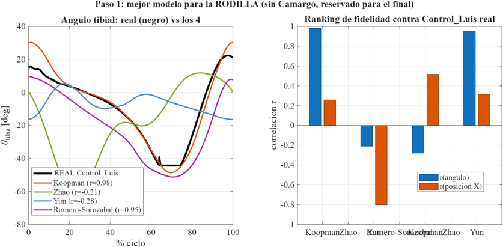

**Selección vs. Maastricht (N=246) — confirma con una población real:**

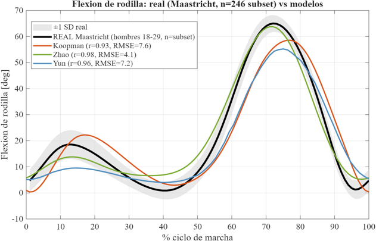

**Selección vs. Ferber (N=40, posición real, antropometría real por sujeto) — la prueba decisiva antes de Kuopio:**

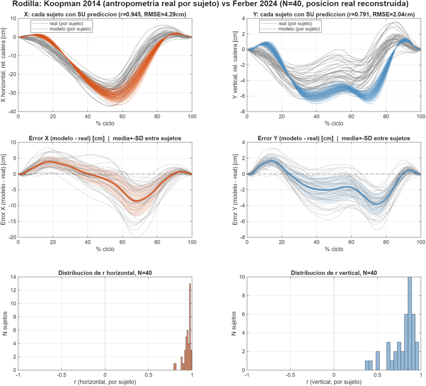

---

## 3. Qué es el modelo de Koopman 2014, en detalle

Fuente: Koopman, van Asseldonk & van der Kooij, *Journal of Biomechanics* 47:1447-1458 (2014), DOI 10.1016/j.jbiomech.2014.01.037.

**Idea central:** cada ángulo articular (cadera ab/aducción, cadera flexo-extensión, rodilla flexo-extensión, tobillo plantar/dorsiflexión) se describe con un **spline quíntico por tramos** que pasa por **6 "eventos clave"** del ciclo de marcha (p. ej. contacto de talón, máximo de apoyo, etc.). En cada evento, el paper publica **regresiones lineales ya ajustadas** que predicen 4 parámetros — posición angular, tiempo (%ciclo), velocidad angular y aceleración angular — a partir de solo dos variables de entrada: **velocidad de marcha (km/h)** y **talla corporal (m)**.

`Koopman2014_Core.m` implementa esto exactamente: las Tablas 1-5 del paper (24 filas de coeficientes de regresión, uno por evento y articulación) están transcritas tal cual — **verificadas con `pdfplumber`** porque el extractor de texto estándar del PDF perdía signos negativos en las tablas (dos celdas quedan con ambigüedad de signo, documentadas y tratadas como 0, sin inventar un valor). No hay ningún parámetro ajustado a datos del proyecto: es reconstrucción matemática directa del paper.

Con los 4 ángulos ya reconstruidos, el ángulo de **inclinación tibial** (la cantidad que necesita el simulador, 0°=tibia vertical) se obtiene por geometría pura combinando cadera+rodilla ("vía rodilla": θ_tibia = θ_muslo − φ_rodilla, con θ_muslo = φ_cadera bajo el supuesto de pelvis vertical, ya verificado a texto completo contra Zhao 2026 pág. 8). Se probaron dos caminos de reducción (vía tobillo y vía rodilla); **vía rodilla ganó con evidencia real** — contra `Control_apoyo_Luis_V4.csv`, vía rodilla da r=0.982 y vía tobillo da r=-0.435 (correlación negativa, en sentido contrario durante el balanceo).

---

## 4. De la antropometría a la curva: cómo se genera la trayectoria

Pipeline completo, en orden (`Generar_Trayectoria.m` es la función de contrato que orquesta todo esto):

1. **Antropometría de entrada** (`Estimar_Antropometria_Core.m`): con solo talla+masa+sexo, completa longitud de muslo/tibia/pie con las fracciones de Drillis & Contini 1966 — verificadas contra la imagen real de la fuente primaria (Winter Fig. 4.1): muslo=0.245×talla, tibia=0.246×talla. Validado contra un sujeto real (Camargo AB06): error 0.72%.
2. **Velocidad y temporización** (`Estimar_Velocidad_Froude_Core.m` + `Tiempo_Ciclo_Koopman2014_Core.m` + `Temporizacion_Core.m`): sin dato medido, la velocidad se estima por número de Froude (Fr=0.25, Raichlen/Pontzer 2011); la duración del ciclo usa la Ec. 3 del propio paper de Koopman; la partición apoyo/balanceo es 60/40 (verificada).
3. **Ángulos por fase** (`Koopman2014_Core.m` vía `Obtener_Theta_Tibia_Candidato.m`): con velocidad y talla, se reconstruye θ_tibia(t) para apoyo y balanceo. Para el balanceo también se pide θ_muslo (`Obtener_Angulos_Candidato.m`, ver punto 4).
4. **Geometría → posición**:
   - **Apoyo:** rotación pura de un segmento rígido (tobillo como pivote fijo, modelo de péndulo invertido — estándar en literatura de marcha, p. ej. Kuo 2007), vía `Cadena_Cinematica_Core.m`, con una traslación horizontal a velocidad constante superpuesta (corregido 24-ago-2026: antes solo se sumaba en balanceo, lo que hacía que X no avanzara monótono). Sin cambios desde entonces — ya validado contra Camargo AB06.
   - **Balanceo — corregido 26-ago-2026:** hasta entonces usaba la MISMA rotación-sobre-tobillo-fijo del apoyo, lo que podía hacer que el punto seguido retrocediera en X en algunos tramos (la rotación de la tibia sola resta más de lo que la traslación constante suma) y que el tobillo quedara a altura constante todo el ciclo — dos artefactos que el propio equipo ya había detectado y documentado como "pendiente" el 24-ago-2026. Se corrigió reconstruyendo la cadera (a partir de la rodilla ya trasladada + el ángulo de muslo) y construyendo la cadena hacia abajo desde ahí (cadera→rodilla→tobillo) — misma lógica que `Cadena_Completa_Core.m` (usada para validar contra Kuopio, sección 5), replicada aquí sin modificar esa función. El tobillo ya se levanta durante el balanceo y la rodilla ya no retrocede — confirmado visualmente (ver figura) y con `Test_Generador_Trayectoria.m` (17/18 — el único que sigue fallando es un trade-off ya declarado desde el 24-ago, ajeno a este cambio, en la fase de apoyo).
5. **Exportación** (`Escribir_CSV_Simulador.m`): mismo formato de cabecera que `Control_apoyo_Luis_V4.csv` real, verificado byte a byte.

El generador sigue solo **un punto** del segmento tibial (por defecto la rodilla, configurable vía `punto_seguimiento_m`) — porque así es exactamente como el simulador real mide (una posición X,Y + un ángulo, no un esqueleto completo). La cadena de muslo (punto 4, balanceo) se usa como **medio geométrico** para ubicar ese punto correctamente, no para exportar la rodilla y el tobillo como dos señales separadas.

**Ejemplo de salida real del generador** (talla 1.71 m, Koopman, ciclo ya continuo, modelo corregido): rodilla y tobillo en X/Y, vista sagital, y ángulo tibial — el tobillo ya se levanta en el balanceo (panel superior derecho e inferior izquierdo) y la rodilla en X ya no retrocede en ningún tramo (panel superior izquierdo):

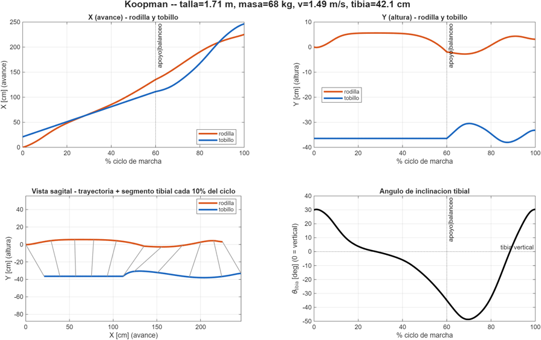

**Los 4 candidatos lado a lado**, con la cadena cinemática completa (ver sección 5) — se ve visualmente por qué Zhao y Yun quedan descartados para tobillo (flexión de rodilla insuficiente en el balanceo); el ángulo tibial de Yun aquí usa la misma vía (tobillo) que la sección 2, corregido 26-ago-2026 (antes esta figura usaba vía rodilla para Yun por una inconsistencia interna entre dos funciones del proyecto):

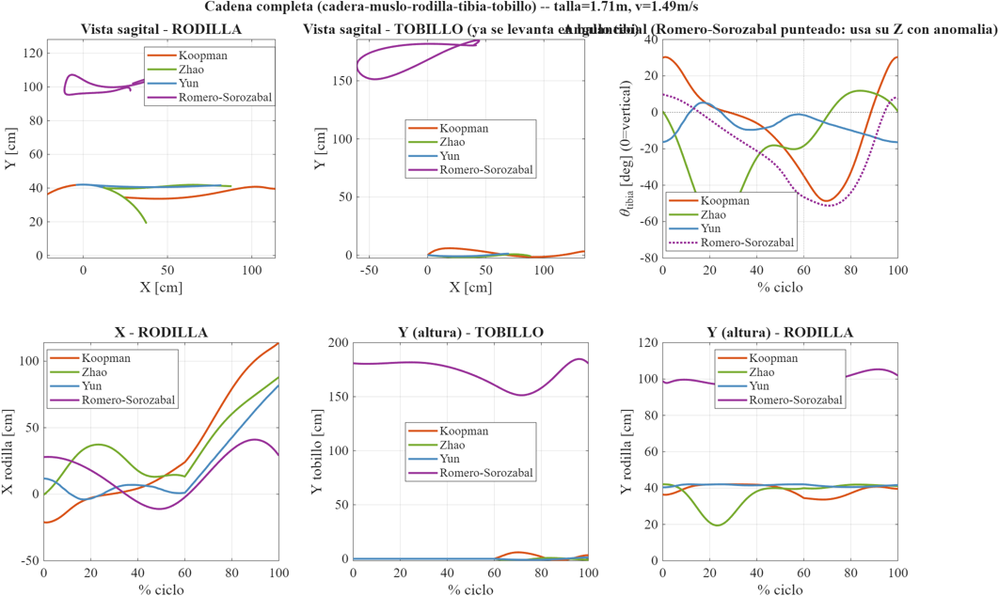

---

## 5. Validación final contra Kuopio 2024: rodilla, tobillo y ángulo tibial

### 5.1 El dataset

**Kuopio Gait Dataset** (Lavikainen et al. 2024, *Data in Brief* 56:110841, DOI 10.5281/zenodo.10559504, CC-BY-4.0) — la única base del proyecto con marcha **overground real** confirmada (3 plataformas de fuerza en el piso, no cinta) **y** antropometría **medida** por sujeto (sexo, talla, masa, largo real de muslo y tibia — no estimada). Se usan **N=15 sujetos piloto** (de 51 totales), 3 ensayos "comf" (velocidad cómoda) cada uno, con eventos de contacto de talón detectados por el método cinemático de Zeni et al. 2008 (Kuopio no trae eventos precalculados).

**Por qué Kuopio, y no las otras bases, para la calibración:** es la única de las 5 bases con overground real (Ferber es en cinta — sin avance neto real que reconstruir) y con antropometría medida (no estimada, como Winter) o individual (no de grupo, como Maastricht). Winter, Maastricht y Ferber siguieron sirviendo, sin tocar ningún coeficiente, para la parte "elegir el modelo" de la sección 2.

### 5.2 El hallazgo central: Koopman sobreestima la excursión angular ~20%

Al revisar el modelo sujeto por sujeto (no en promedio — ver 5.3) apareció el mismo defecto, medido de forma independiente en dos segmentos distintos:

| Ángulo | Correlación de forma (r) | Ganancia LOSO (a aplicar) |
|---|---|---|
| Muslo (cadera) | 0.971 | 0.769 |
| Tibia | 0.992 | 0.811 |

**Conclusión:** Koopman 2014 reproduce la *forma* del ciclo casi exactamente (r=0.97-0.99) pero **sobreestima el rango angular ~20-23%** en esta población — un solo defecto del modelo publicado, no uno por eje ni por segmento (las dos ganancias, medidas por separado contra segmentos distintos, caen en el mismo rango).

**Corrección aplicada — calibración afín, LOSO:** `θ_final = a + b·θ_Koopman`, con los coeficientes `(a,b)` de cada sujeto ajustados usando **solo los otros 14** (nunca el propio sujeto — sin circularidad). La corrección se aplica al **ángulo**, antes de propagar por la geometría — no a la posición ya calculada (un intento anterior calibrando la posición aplastaba la curva para minimizar el error, sin sentido físico; ver `CIERRE_RODILLA.md` §8 para el detalle completo del diagnóstico).

### 5.3 Por qué las figuras muestran cada sujeto por separado (no un promedio)

El modelo se alimenta de sexo/talla/masa/velocidad de **cada** sujeto — promediar las curvas de 15 personas con antropometría distinta mezclaría trayectorias que no son comparables entre sí. Por eso, en las 3 figuras de grupo de abajo, cada línea gris (real) está pareada con su propia predicción de color — nunca una curva "media" contra otra "media". Además, en las 3 carpetas se probaron los **mismos 6 sujetos** de antropometría diversa (el más pesado, el más alto, el más liviano, la más baja, una mujer y un hombre de talla media) en una figura individual — la prueba de referencia.

### 5.4 Resultado — RODILLA

Modelo: geometría continua (`Cadena_Cinematica_Core.m` extendida a rodilla-relativa-a-cadera) + plantilla LOSO del vaivén vertical de cadera + cierre de ciclo + ángulo de muslo calibrado.

| Eje | r (medio) | RMSE (medio) |
|---|---|---|
| Horizontal (X) | **0.998** | 3.97 cm |
| Vertical (Y) | **0.920** | 0.72 cm (amplitud modelo/real: 82%) |

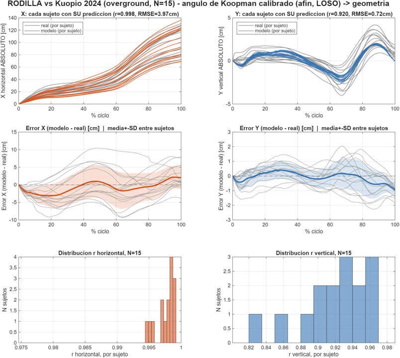

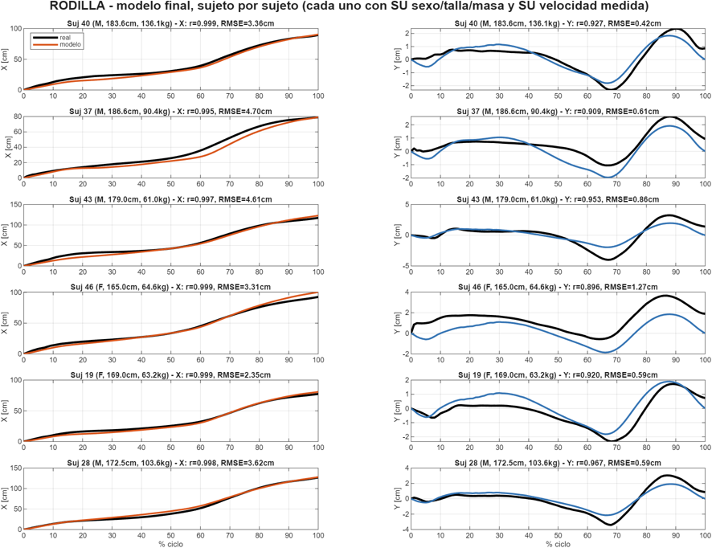

### 5.5 Resultado — TOBILLO

El tobillo hereda el error de **dos** ángulos encadenados (muslo + tibia), así que se calibran los dos por separado (LOSO) antes de propagar. Además necesitó un modelo geométrico más fino que el de rodilla: `Cadena_Completa_Core.m` (cadena consciente de fase: en apoyo el tobillo es el pivote fijo y la cadena se construye hacia arriba; en balanceo la cadera avanza y la cadena se construye hacia abajo — así el tobillo se levanta solo por la flexión de rodilla, sin curva inventada), más un **residuo empírico de "rockers"** (LOSO, el mecanismo real de talón→tobillo→antepié que la idealización de pivote fijo no captura del todo) y un **cierre de zancada** en X (la zancada real es velocidad×tiempo de ciclo, una cantidad que el generador conoce sin datos medidos).

| Eje | r (medio) | RMSE (medio) |
|---|---|---|
| Horizontal (X) | **0.998** | 2.90 cm |
| Vertical (Y) | **0.985** | 1.54 cm (amplitud modelo/real: 91%) |

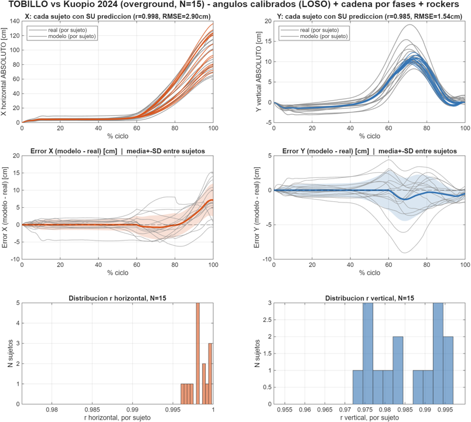

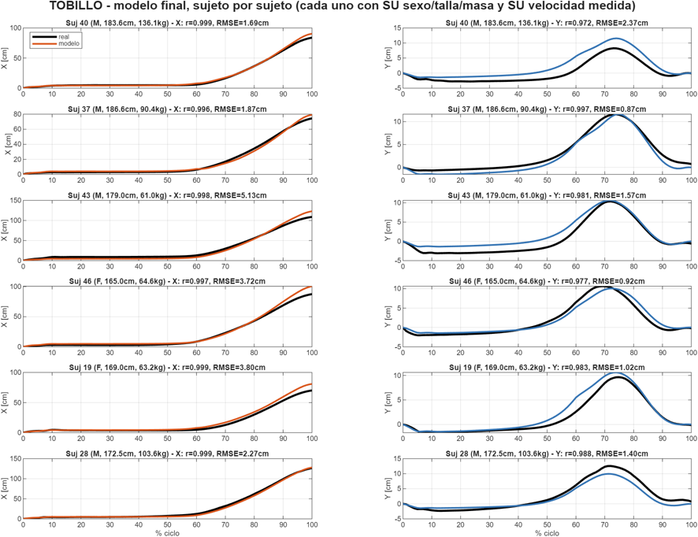

### 5.6 Resultado — ÁNGULO DE INCLINACIÓN TIBIAL

Esta fue la pieza que reveló el hallazgo central (5.2): la forma ya era casi perfecta (r=0.992) pero con un sesgo sistemático grande — sin calibrar, el RMSE (11.24°) clasificaba como "Deficiente" en la escala propia del proyecto (`RMSEnorm`, `CODIGOS/VALIDACIONES/Calcular_Metricas_Curva.m`); calibrado, pasa a "Excelente".

| | r | RMSE | RMSEnorm | Clasificación |
|---|---|---|---|---|
| Sin calibrar | 0.992 | 11.24° | 3.53 | Deficiente |
| **Calibrado (LOSO)** | 0.992 | **3.50°** | **0.92** | **Excelente** |

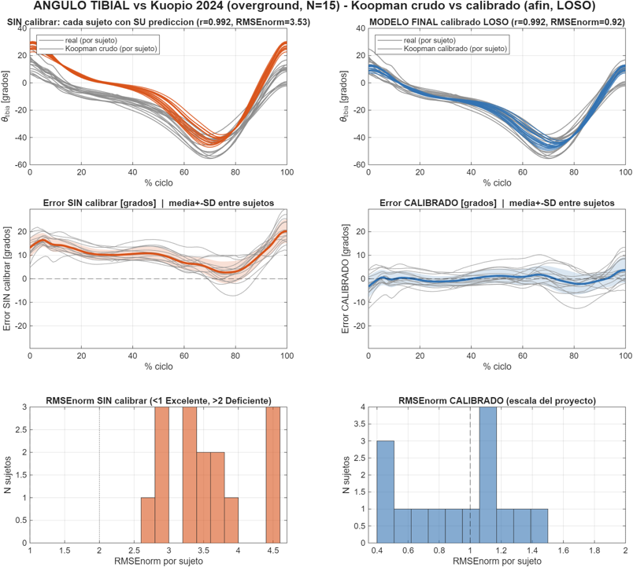

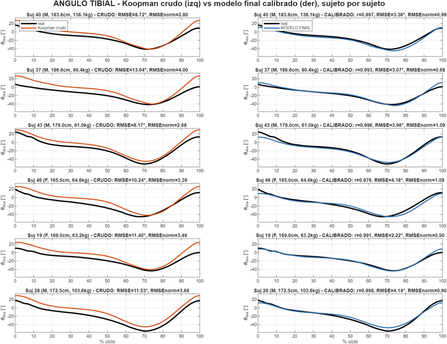

### 5.7 Zhao y Yun replicados con el mismo pipeline (27-ago-2026) — Koopman gana en TOBILLO e INCLINACION_TIBIAL, a diferencia de RODILLA/Maastricht

Tarea nocturna autónoma: se construyó el mismo pipeline (calibración LOSO, `Cadena_Completa_Core`, rockers, cierre de ciclo/zancada) para Zhao 2026 y Yun 2014 en TOBILLO e INCLINACION_TIBIAL, usando la configuración **nativa** de cada modelo (sin el "truco de lado" de la sección 2, que ahí sí ayudó a Zhao/Yun en Maastricht). Detalle completo: `TOBILLO/CIERRE_TOBILLO.md` §11, `INCLINACION_TIBIAL/CIERRE_INCLINACION_TIBIAL.md` §9.

| TOBILLO | Koopman | Zhao | Yun |
|---|---|---|---|
| X — r / RMSE | **0.998 / 2.90cm** | 0.974 / 10.99cm | 0.990 / 7.08cm |
| Y — r / RMSE | **0.985 / 1.54cm** | 0.914 / 2.51cm | 0.831 / 3.39cm |

| ÁNGULO TIBIAL | Koopman | Zhao | Yun |
|---|---|---|---|
| r crudo | 0.992 | -0.303 | -0.300 |
| RMSEnorm calibrado | **0.92 (Excelente)** | 3.39 (Deficiente) | 4.42 (Deficiente) |

**A diferencia de Maastricht (sección 2), aquí Koopman gana con claridad en los 3 candidatos, en ambas piezas.** La razón: el "truco de lado" que rescataba a Zhao/Yun en Maastricht corrige específicamente un defecto de fase del **canal de rodilla/flexión nativa** (`RODILLA/CIERRE_RODILLA.md` §1-ter) — pero TOBILLO e INCLINACION_TIBIAL dependen del ángulo **tibial** (cadera−rodilla combinados, o rodilla-vía-tobillo según el candidato), no de la flexión de rodilla aislada, así que no está garantizado que el mismo truco ayude de la misma forma. **No se probó** en esta tarea (decisión D2 de `DECISIONES.md`, deliberadamente no reabierta) — queda como la pregunta de mayor valor antes de cerrar la comparación final entre candidatos.

---

## 6. Mapa de atribución (qué viene de dónde)

Para que quede trazable al redactar Métodos:

- **De Koopman 2014, sin modificar:** las 4 curvas angulares (θ_cadera×2, φ_rodilla, φ_tobillo) y su reducción geométrica a θ_tibia.
- **Aporte propio — geometría:** `Cadena_Cinematica_Core.m` (generador real, un segmento) y `Cadena_Completa_Core.m` (validación, cadena completa cadera-tobillo).
- **Aporte propio — corrección empírica:** la calibración afín LOSO del ángulo (escala ~20%, un solo defecto transversal a los 2 ángulos), la plantilla de vaivén vertical de cadera (LOSO), el residuo de rockers en tobillo (LOSO) y el cierre de ciclo/zancada — todos ajustados **solo con Kuopio**, nunca con las bases usadas para elegir el modelo.
- **Rol de Kuopio:** examen real independiente que reveló el sesgo de escala y aportó los coeficientes LOSO — nunca se usó para ajustar los coeficientes de Koopman en sí ni la lógica de fases, que ya estaban fijados antes.

## 7. Limitaciones declaradas (no ocultas)

- La amplitud vertical de rodilla llega al 82% de la real (no 100%) — el residuo es variabilidad real entre sujetos que una plantilla poblacional (N=15) no captura del todo; ampliar N es el único camino de mejora que queda.
- El cierre de zancada en X de tobillo usa velocidad×tiempo, que sobreestima ~7 cm el desplazamiento real medido (101.6 vs 94.5 cm) — probablemente por desfase entre la detección de eventos de Zeni y el marcador de tobillo.
- La comparación contra Ferber (sección 2) usa velocidad **estimada por Froude**, no la velocidad real que Ferber sí documenta — a diferencia de las comparaciones contra Kuopio, que sí usan velocidad real medida. Esto no invalida el resultado (de hecho refleja mejor el uso real del generador, que tampoco tendrá velocidad medida), pero significa que las 4 fuentes de la tabla de la sección 2 no están bajo el mismo protocolo exacto — vale la pena declararlo así en Métodos.
- Zhao y Yun heredan un defasaje de pico de flexión de rodilla (limitación del modelo publicado, no corregible sin tocar sus coeficientes) — por eso quedan fuera como candidatos ganadores, aunque siguen implementados y disponibles para comparación.

## 8. Qué falta (fuera del alcance de este documento)

- Cómo se juntan rodilla+tobillo+ángulo tibial en un solo generador coherente, y si esto reemplaza o convive con el plan de ensamble de 4 modelos (`docs/planificacion/plan_ensamble_multimodelo.md`) — pregunta abierta, pospuesta por decisión explícita del usuario desde el 24-ago-2026, sin cerrar todavía.
- **Si el "truco de lado" de Zhao/Yun (sección 2, sección 5.7) debe probarse también en TOBILLO/INCLINACION_TIBIAL** — no se decidió en la tarea autónoma del 27-ago-2026 (ver `TOBILLO/CIERRE_TOBILLO.md` §11), porque el truco corrige un canal distinto (rodilla/flexión nativa) del que usan estas dos piezas (ángulo tibial combinado).
- Con Koopman ganando en 2 de 3 piezas (TOBILLO, INCLINACION_TIBIAL) y empatando/perdiendo en la tercera (RODILLA/Maastricht, sección 2), la elección final de "un solo modelo ganador" sigue sin cerrarse — Ferber y Kuopio para RODILLA todavía no se re-evaluaron con Zhao/Yun corregidos (ver `RODILLA/CIERRE_RODILLA.md` §1-ter).
